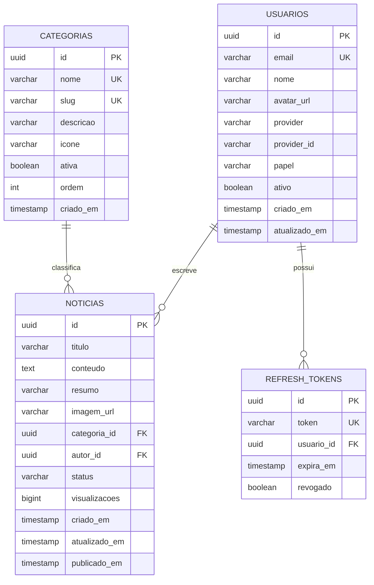

# 📰 Plano de Implementação Completo — Portal de Notícias Populares

> **Stack:** Java 25 LTS + Spring Boot 3.x + Angular 20+ + PostgreSQL  
> **Princípios:** Clean Architecture, DDD, SOLID, DRY, KISS, YAGNI  
> **Documentação de regras:** `regras-desenvolvimento-java-angular/`

---

## 📋 Visão Geral do MVP

| Aspecto | Detalhe |
|---------|---------|
| **Backend** | Java 25 LTS, Spring Boot 3.x, Clean Architecture + DDD, Liquibase, Lombok |
| **Frontend** | Angular 20+, Standalone Components, Signals, Slash Command Editor |
| **Banco** | PostgreSQL 16 (instância Oracle 1GB RAM) |
| **Auth** | Google OAuth2 + JWT (access + refresh token) |
| **IA** | Gemini API — geração de imagem (Imagen 3 / nano-banana) + texto de notícias |
| **Infra Local** | Docker Compose (front + back + banco) |
| **Deploy Futuro** | Frontend: Vercel · Backend + Banco: Oracle Cloud (1GB RAM) |

---

## 📐 Modelo de Dados



---

## 🔐 Endpoints da API

| Método | Endpoint | Auth | Descrição |
|--------|----------|------|-----------|
| POST | `/api/v1/auth/google` | ❌ | Login com token Google |
| POST | `/api/v1/auth/refresh` | ❌ | Refresh token |
| GET | `/api/v1/auth/perfil` | ✅ | Perfil do usuário logado |
| GET | `/api/v1/categorias` | ❌ | Listar categorias ativas |
| POST | `/api/v1/categorias` | 🔒 ADMIN | Criar categoria |
| PUT | `/api/v1/categorias/{id}` | 🔒 ADMIN | Atualizar categoria |
| DELETE | `/api/v1/categorias/{id}` | 🔒 ADMIN | Desativar categoria |
| GET | `/api/v1/noticias` | ❌ | Feed paginado (filtro por categoria) |
| GET | `/api/v1/noticias/{id}` | ❌ | Detalhe da notícia |
| POST | `/api/v1/noticias` | ✅ | Criar notícia |
| PUT | `/api/v1/noticias/{id}` | ✅ | Editar (autor ou admin) |
| DELETE | `/api/v1/noticias/{id}` | ✅ | Excluir (autor ou admin) |
| GET | `/api/v1/noticias/minhas` | ✅ | Notícias do autor logado |
| POST | `/api/v1/ia/gerar-imagem` | ✅ | Gerar imagem com Gemini |
| POST | `/api/v1/ia/gerar-texto` | ✅ | Gerar texto de notícia com IA |
| POST | `/api/v1/ia/refinar-texto` | ✅ | Refinar texto existente com IA |
| POST | `/api/v1/upload/imagem` | ✅ | Upload de imagem manual |
| GET | `/api/v1/admin/usuarios` | 🔒 ADMIN | Listar usuários |
| PATCH | `/api/v1/admin/usuarios/{id}` | 🔒 ADMIN | Ativar/desativar usuário |
| GET | `/api/v1/admin/dashboard` | 🔒 ADMIN | Estatísticas do portal |

---

## 🏗️ Estrutura de Pastas Completa

### Backend

```
backend/
├── Dockerfile.dev
├── pom.xml
└── src/
    ├── main/
    │   ├── java/com/noticiapopular/
    │   │   ├── NoticiapopularApplication.java
    │   │   │
    │   │   ├── kernel/
    │   │   │   ├── domain/
    │   │   │   │   ├── valueobjects/
    │   │   │   │   │   └── Dinheiro.java
    │   │   │   │   └── exceptions/
    │   │   │   │       ├── DominioException.java
    │   │   │   │       ├── EntidadeNaoEncontradaException.java
    │   │   │   │       ├── RegraDeNegocioException.java
    │   │   │   │       ├── EstadoInvalidoException.java
    │   │   │   │       ├── ValidacaoException.java
    │   │   │   │       └── AcessoNegadoException.java
    │   │   │   ├── application/
    │   │   │   │   ├── dtos/
    │   │   │   │   │   └── PaginacaoDTO.java
    │   │   │   │   └── ports/
    │   │   │   │       └── UseCase.java
    │   │   │   └── infrastructure/
    │   │   │       ├── config/
    │   │   │       │   ├── JacksonConfig.java
    │   │   │       │   ├── CorsConfig.java
    │   │   │       │   └── WebConfig.java
    │   │   │       ├── mappers/
    │   │   │       │   └── ObjectMapperFactory.java
    │   │   │       ├── security/
    │   │   │       │   ├── SecurityConfig.java
    │   │   │       │   ├── JwtAuthenticationFilter.java
    │   │   │       │   ├── JwtTokenProvider.java
    │   │   │       │   └── GoogleOAuthAdapter.java
    │   │   │       └── web/
    │   │   │           ├── GlobalExceptionHandler.java
    │   │   │           ├── ErroResponse.java
    │   │   │           ├── ErroValidacaoResponse.java
    │   │   │           └── RequestIdFilter.java
    │   │   │
    │   │   ├── autenticacao/
    │   │   │   ├── domain/
    │   │   │   │   ├── entities/
    │   │   │   │   │   └── Usuario.java
    │   │   │   │   ├── valueobjects/
    │   │   │   │   │   ├── Email.java
    │   │   │   │   │   └── PapelUsuario.java
    │   │   │   │   └── exceptions/
    │   │   │   │       └── UsuarioNaoEncontradoException.java
    │   │   │   ├── application/
    │   │   │   │   ├── usecases/
    │   │   │   │   │   ├── AutenticarComGoogleUseCase.java
    │   │   │   │   │   ├── RefrescarTokenUseCase.java
    │   │   │   │   │   └── BuscarPerfilUseCase.java
    │   │   │   │   ├── dtos/
    │   │   │   │   │   ├── LoginGoogleRequest.java
    │   │   │   │   │   ├── TokenResponse.java
    │   │   │   │   │   └── PerfilUsuarioDTO.java
    │   │   │   │   └── ports/
    │   │   │   │       └── out/
    │   │   │   │           ├── UsuarioRepositoryPort.java
    │   │   │   │           ├── TokenProviderPort.java
    │   │   │   │           └── GoogleOAuthPort.java
    │   │   │   └── infrastructure/
    │   │   │       ├── persistence/
    │   │   │       │   ├── entities/
    │   │   │       │   │   ├── UsuarioEntity.java
    │   │   │       │   │   └── RefreshTokenEntity.java
    │   │   │       │   ├── repositories/
    │   │   │       │   │   ├── UsuarioJpaRepository.java
    │   │   │       │   │   ├── RefreshTokenJpaRepository.java
    │   │   │       │   │   └── UsuarioRepositoryAdapter.java
    │   │   │       │   └── mappers/
    │   │   │       │       └── UsuarioMapper.java
    │   │   │       └── web/
    │   │   │           └── controllers/
    │   │   │               └── AuthController.java
    │   │   │
    │   │   ├── categorias/
    │   │   │   ├── domain/
    │   │   │   │   ├── entities/
    │   │   │   │   │   └── Categoria.java
    │   │   │   │   ├── valueobjects/
    │   │   │   │   │   └── Slug.java
    │   │   │   │   └── exceptions/
    │   │   │   │       └── CategoriaNaoEncontradaException.java
    │   │   │   ├── application/
    │   │   │   │   ├── usecases/
    │   │   │   │   │   ├── CriarCategoriaUseCase.java
    │   │   │   │   │   ├── ListarCategoriasUseCase.java
    │   │   │   │   │   ├── AtualizarCategoriaUseCase.java
    │   │   │   │   │   └── DesativarCategoriaUseCase.java
    │   │   │   │   ├── dtos/
    │   │   │   │   │   ├── CategoriaDTO.java
    │   │   │   │   │   └── CriarCategoriaRequest.java
    │   │   │   │   └── ports/
    │   │   │   │       └── out/
    │   │   │   │           └── CategoriaRepositoryPort.java
    │   │   │   └── infrastructure/
    │   │   │       ├── persistence/
    │   │   │       │   ├── entities/
    │   │   │       │   │   └── CategoriaEntity.java
    │   │   │       │   ├── repositories/
    │   │   │       │   │   ├── CategoriaJpaRepository.java
    │   │   │       │   │   └── CategoriaRepositoryAdapter.java
    │   │   │       │   └── mappers/
    │   │   │       │       └── CategoriaMapper.java
    │   │   │       └── web/
    │   │   │           └── controllers/
    │   │   │               └── CategoriaController.java
    │   │   │
    │   │   ├── noticias/
    │   │   │   ├── domain/
    │   │   │   │   ├── entities/
    │   │   │   │   │   └── Noticia.java
    │   │   │   │   ├── valueobjects/
    │   │   │   │   │   ├── ConteudoNoticia.java
    │   │   │   │   │   └── StatusNoticia.java
    │   │   │   │   └── exceptions/
    │   │   │   │       └── NoticiaNaoEncontradaException.java
    │   │   │   ├── application/
    │   │   │   │   ├── usecases/
    │   │   │   │   │   ├── CriarNoticiaUseCase.java
    │   │   │   │   │   ├── PublicarNoticiaUseCase.java
    │   │   │   │   │   ├── EditarNoticiaUseCase.java
    │   │   │   │   │   ├── ExcluirNoticiaUseCase.java
    │   │   │   │   │   ├── ListarNoticiasFeedUseCase.java
    │   │   │   │   │   ├── BuscarNoticiaPorIdUseCase.java
    │   │   │   │   │   └── ListarNoticiasPorAutorUseCase.java
    │   │   │   │   ├── dtos/
    │   │   │   │   │   ├── NoticiaDTO.java
    │   │   │   │   │   ├── NoticiaResumoDTO.java
    │   │   │   │   │   ├── CriarNoticiaRequest.java
    │   │   │   │   │   ├── EditarNoticiaRequest.java
    │   │   │   │   │   └── FiltroNoticiaRequest.java
    │   │   │   │   └── ports/
    │   │   │   │       └── out/
    │   │   │   │           ├── NoticiaRepositoryPort.java
    │   │   │   │           └── ArmazenamentoImagemPort.java
    │   │   │   └── infrastructure/
    │   │   │       ├── persistence/
    │   │   │       │   ├── entities/
    │   │   │       │   │   └── NoticiaEntity.java
    │   │   │       │   ├── repositories/
    │   │   │       │   │   ├── NoticiaJpaRepository.java
    │   │   │       │   │   └── NoticiaRepositoryAdapter.java
    │   │   │       │   └── mappers/
    │   │   │       │       └── NoticiaMapper.java
    │   │   │       ├── storage/
    │   │   │       │   └── ArmazenamentoImagemAdapter.java
    │   │   │       └── web/
    │   │   │           └── controllers/
    │   │   │               └── NoticiaController.java
    │   │   │
    │   │   └── inteligenciaartificial/
    │   │       ├── application/
    │   │       │   ├── usecases/
    │   │       │   │   ├── GerarImagemComGeminiUseCase.java
    │   │       │   │   ├── GerarTextoNoticiaUseCase.java
    │   │       │   │   └── RefinarTextoNoticiaUseCase.java
    │   │       │   ├── dtos/
    │   │       │   │   ├── GerarImagemRequest.java
    │   │       │   │   ├── ImagemGeradaResponse.java
    │   │       │   │   ├── GerarTextoRequest.java
    │   │       │   │   ├── TextoGeradoResponse.java
    │   │       │   │   └── RefinarTextoRequest.java
    │   │       │   └── ports/
    │   │       │       └── out/
    │   │       │           └── GeminiApiPort.java
    │   │       └── infrastructure/
    │   │           ├── adapters/
    │   │           │   └── GeminiApiAdapter.java
    │   │           ├── config/
    │   │           │   └── GeminiConfig.java
    │   │           └── web/
    │   │               └── controllers/
    │   │                   └── InteligenciaArtificialController.java
    │   │
    │   └── resources/
    │       ├── application.yml
    │       ├── application-dev.yml
    │       ├── application-prod.yml
    │       └── db/changelog/
    │           ├── db.changelog-master.yml
    │           ├── changes/
    │           │   ├── 20260315060000-criar-tabela-usuarios.yml
    │           │   ├── 20260315060100-criar-tabela-refresh-tokens.yml
    │           │   ├── 20260315060200-criar-tabela-categorias.yml
    │           │   └── 20260315060300-criar-tabela-noticias.yml
    │           └── data/
    │               └── 20260315060400-seed-categorias.yml
    │
    └── test/java/com/noticiapopular/
        ├── autenticacao/
        ├── categorias/
        ├── noticias/
        ├── inteligenciaartificial/
        ├── architecture/
        │   └── ArchitectureTest.java
        └── fixtures/
```

### Frontend

```
frontend/
├── Dockerfile.dev
├── angular.json
├── package.json
├── tsconfig.json
├── proxy.conf.json
└── src/
    ├── index.html
    ├── main.ts
    ├── styles.css
    └── app/
        ├── app.component.ts
        ├── app.component.html
        ├── app.component.css
        ├── app.routes.ts
        ├── app.config.ts
        │
        ├── core/
        │   ├── guards/
        │   │   ├── auth.guard.ts
        │   │   └── admin.guard.ts
        │   ├── interceptors/
        │   │   ├── auth.interceptor.ts
        │   │   └── error.interceptor.ts
        │   └── config/
        │       └── environment.ts
        │
        ├── shared/
        │   ├── components/
        │   │   ├── navbar/
        │   │   ├── footer/
        │   │   ├── loading/
        │   │   ├── skeleton/
        │   │   ├── toast/
        │   │   ├── modal-base/
        │   │   ├── categoria-badge/
        │   │   └── imagem-otimizada/
        │   ├── pipes/
        │   │   ├── tempo-relativo.pipe.ts
        │   │   └── truncar.pipe.ts
        │   └── directives/
        │       └── click-fora.directive.ts
        │
        ├── models/
        │   ├── usuario.model.ts
        │   ├── categoria.model.ts
        │   ├── noticia.model.ts
        │   ├── token.model.ts
        │   └── paginacao.model.ts
        │
        ├── services/
        │   ├── auth.service.ts
        │   ├── categoria.service.ts
        │   ├── noticia.service.ts
        │   ├── inteligencia-artificial.service.ts
        │   ├── upload.service.ts
        │   └── notification.service.ts
        │
        ├── utils/
        │   ├── formato.util.ts
        │   ├── validacao.util.ts
        │   └── storage.util.ts
        │
        └── components/
            ├── auth/
            │   ├── login/
            │   │   ├── login.component.ts
            │   │   ├── login.component.html
            │   │   └── login.component.css
            │   └── callback/
            │       └── google-callback.component.ts
            │
            ├── feed/
            │   ├── feed-page/
            │   │   ├── feed-page.component.ts
            │   │   ├── feed-page.component.html
            │   │   └── feed-page.component.css
            │   ├── noticia-card/
            │   │   ├── noticia-card.component.ts
            │   │   ├── noticia-card.component.html
            │   │   └── noticia-card.component.css
            │   ├── noticia-detalhe/
            │   │   ├── noticia-detalhe.component.ts
            │   │   ├── noticia-detalhe.component.html
            │   │   └── noticia-detalhe.component.css
            │   ├── filtro-categorias/
            │   │   └── filtro-categorias.component.ts
            │   └── composables/
            │       ├── use-feed-noticias.ts
            │       └── use-filtro-categorias.ts
            │
            ├── noticia-editor/
            │   ├── noticia-editor.component.ts
            │   ├── noticia-editor.component.html
            │   ├── noticia-editor.component.css
            │   ├── components/
            │   │   └── slash-command-menu/
            │   │       ├── slash-command-menu.component.ts
            │   │       ├── slash-command-menu.component.html
            │   │       └── slash-command-menu.component.css
            │   ├── models/
            │   │   └── content-block.model.ts
            │   └── composables/
            │       └── use-editor-blocos.ts
            │
            ├── noticia-modal/
            │   ├── noticia-modal.component.ts
            │   ├── noticia-modal.component.html
            │   ├── noticia-modal.component.css
            │   └── composables/
            │       ├── use-gerar-imagem.ts
            │       ├── use-gerar-noticia.ts
            │       └── use-preview-noticia.ts
            │
            ├── perfil/
            │   ├── minhas-noticias/
            │   │   ├── minhas-noticias.component.ts
            │   │   ├── minhas-noticias.component.html
            │   │   └── minhas-noticias.component.css
            │   └── perfil-page/
            │       └── perfil-page.component.ts
            │
            └── admin/
                ├── admin-dashboard/
                │   └── admin-dashboard.component.ts
                ├── admin-categorias/
                │   └── admin-categorias.component.ts
                ├── admin-noticias/
                │   └── admin-noticias.component.ts
                └── admin-usuarios/
                    └── admin-usuarios.component.ts
```

---

## 🚀 ETAPA 1 — Infraestrutura e Scaffolding

### 1.1 Docker Compose (`docker-compose.yml`)

**Arquivo:** `docker-compose.yml` na raiz do projeto.

**Serviços:**

#### PostgreSQL
- **Imagem:** `postgres:16-alpine` (mais leve, ideal para 1GB RAM)
- **Porta:** `5432:5432`
- **Volume:** `postgres-data:/var/lib/postgresql/data`
- **Variáveis:** `POSTGRES_DB`, `POSTGRES_USER`, `POSTGRES_PASSWORD` via `.env`
- **Healthcheck:** `pg_isready` com interval 10s, timeout 5s, retries 5
- **Limite de memória:** `mem_limit: 384m`
- **Configuração otimizada para 1GB RAM:**
  ```
  POSTGRES_SHARED_BUFFERS=128MB
  POSTGRES_WORK_MEM=4MB
  POSTGRES_EFFECTIVE_CACHE_SIZE=256MB
  POSTGRES_MAINTENANCE_WORK_MEM=64MB
  POSTGRES_MAX_CONNECTIONS=30
  ```

#### Backend (Spring Boot)
- **Dockerfile.dev:** Multi-stage com `eclipse-temurin:25-jdk-alpine`
- **Porta:** `8080:8080` (app) + `5005:5005` (debug)
- **Volume:** `./backend:/app` + `maven-cache:/root/.m2` + `/app/target` (anônimo)
- **Limite de memória:** `mem_limit: 512m`
- **Variáveis de ambiente:**
  ```yaml
  SPRING_PROFILES_ACTIVE: dev
  SPRING_DATASOURCE_URL: jdbc:postgresql://postgres:5432/${PG_DATABASE}
  SPRING_DATASOURCE_USERNAME: ${PG_USER}
  SPRING_DATASOURCE_PASSWORD: ${PG_PASSWORD}
  JWT_SECRET: ${JWT_SECRET}
  JWT_EXPIRATION: ${JWT_EXPIRATION:-3600000}
  GOOGLE_CLIENT_ID: ${GOOGLE_CLIENT_ID}
  GOOGLE_CLIENT_SECRET: ${GOOGLE_CLIENT_SECRET}
  GEMINI_API_KEY: ${GEMINI_API_KEY}
  JAVA_OPTS: >-
    -XX:+UseG1GC
    -XX:MaxRAMPercentage=60.0
    -XX:+UseStringDeduplication
    -Xss256k
    -XX:+UseCompressedOops
  ```
- **Comando:** `mvn spring-boot:run -Dspring-boot.run.jvmArguments="...debug..."`
- **Depende de:** postgres (condition: service_healthy)

#### Frontend (Angular)
- **Dockerfile.dev:** `node:22-alpine`
- **Porta:** `4200:4200`
- **Volume:** `./frontend:/app` + `frontend-node-modules:/app/node_modules`
- **Variáveis:** `NG_APP_API_URL`, `NG_APP_GOOGLE_CLIENT_ID`
- **Comando:** `npm run start -- --host 0.0.0.0 --poll 2000`
- **Depende de:** backend

#### pgAdmin (profile tools — opcional)
- **Imagem:** `dpage/pgadmin4:latest`
- **Porta:** `8081:80`
- **Profile:** `tools` (ativado com `docker-compose --profile tools up`)

### 1.2 Arquivo `.env.example`

```env
# === Banco de Dados ===
PG_DATABASE=noticiapopular
PG_USER=noticiapopular
PG_PASSWORD=TROCAR_SENHA_SEGURA

# === JWT ===
JWT_SECRET=TROCAR_POR_CHAVE_256_BITS_MINIMO_32_CHARS
JWT_EXPIRATION=3600000

# === Google OAuth2 ===
GOOGLE_CLIENT_ID=
GOOGLE_CLIENT_SECRET=

# === Gemini API ===
GEMINI_API_KEY=

# === Frontend ===
NG_APP_API_URL=http://localhost:8080/api
NG_APP_GOOGLE_CLIENT_ID=
```

### 1.3 Backend — `pom.xml`

**Group ID:** `com.noticiapopular`  
**Artifact ID:** `portal-noticias`  
**Java:** 25  
**Spring Boot:** 3.x (última minor estável)

**Dependências principais:**

```xml
<!-- Spring Boot Starters -->
spring-boot-starter-web
spring-boot-starter-data-jpa
spring-boot-starter-security
spring-boot-starter-validation
spring-boot-starter-actuator
spring-boot-starter-webflux          <!-- WebClient para Gemini API -->
spring-boot-starter-oauth2-resource-server

<!-- Banco -->
postgresql (runtime)
liquibase-core

<!-- JWT -->
io.jsonwebtoken:jjwt-api
io.jsonwebtoken:jjwt-impl (runtime)
io.jsonwebtoken:jjwt-jackson (runtime)

<!-- Lombok -->
lombok (compileOnly + annotationProcessor)

<!-- Google OAuth -->
google-api-client
google-auth-library-oauth2-http

<!-- Testes -->
spring-boot-starter-test
mockito-core
assertj-core
testcontainers (postgresql)
archunit-junit5
net.datafaker:datafaker
```

### 1.4 Backend — `application.yml` (profile dev)

```yaml
server:
  port: 8080

spring:
  application:
    name: portal-noticias
  datasource:
    url: ${SPRING_DATASOURCE_URL:jdbc:postgresql://localhost:5432/noticiapopular}
    username: ${SPRING_DATASOURCE_USERNAME:noticiapopular}
    password: ${SPRING_DATASOURCE_PASSWORD}
    hikari:
      maximum-pool-size: 10
      minimum-idle: 2
      connection-timeout: 20000
  jpa:
    hibernate:
      ddl-auto: validate
    show-sql: false
    properties:
      hibernate:
        dialect: org.hibernate.dialect.PostgreSQLDialect
        format_sql: true
  liquibase:
    change-log: classpath:db/changelog/db.changelog-master.yml
  servlet:
    multipart:
      max-file-size: 10MB
      max-request-size: 10MB

app:
  jwt:
    secret: ${JWT_SECRET}
    expiration-ms: ${JWT_EXPIRATION:3600000}
    refresh-expiration-ms: 604800000
  google:
    client-id: ${GOOGLE_CLIENT_ID}
  gemini:
    api-key: ${GEMINI_API_KEY}
    base-url: https://generativelanguage.googleapis.com/v1beta
  upload:
    diretorio: ./uploads
    tamanho-maximo-mb: 10

management:
  endpoints:
    web:
      exposure:
        include: health,info,metrics
  endpoint:
    health:
      show-details: when-authorized

logging:
  level:
    root: INFO
    com.noticiapopular: DEBUG
    org.springframework.security: WARN
    org.hibernate.SQL: WARN
```

### 1.5 Backend — Kernel Compartilhado

#### `DominioException.java` (base da hierarquia)
```java
public abstract class DominioException extends RuntimeException {
    protected DominioException(String mensagem) {
        super(mensagem);
    }
}
```

#### Hierarquia de exceções:
- `EntidadeNaoEncontradaException extends DominioException`
- `RegraDeNegocioException extends DominioException`
- `EstadoInvalidoException extends RegraDeNegocioException`
- `ValidacaoException extends DominioException`
- `AcessoNegadoException extends DominioException`

#### `GlobalExceptionHandler.java`
- `@RestControllerAdvice` com handlers para cada exceção
- Retorna `ErroResponse(mensagem, codigo)` ou `ErroValidacaoResponse(mensagem, List<CampoErro>)`
- `EntidadeNaoEncontradaException` → 404
- `RegraDeNegocioException` → 422
- `ValidacaoException` → 400
- `AcessoNegadoException` → 403
- `MethodArgumentNotValidException` → 400 com field errors

#### `JacksonConfig.java`
- Bean `ObjectMapper` configurado globalmente (dates ISO, fail on unknown properties, etc.)
- Injetado via DI — **NUNCA** `new ObjectMapper()`

#### `RequestIdFilter.java`
- Gera UUID para cada request, coloca no MDC e no header `X-Request-Id`

### 1.6 Frontend — Scaffolding Angular

**Comando de criação:**
```bash
npx -y @angular/cli@latest new portal-noticias --standalone --routing --style=css --ssr=false --directory=./
```

**Configurações pós-criação:**
- `tsconfig.json`: `strict: true`, paths para `@core/*`, `@shared/*`, `@models/*`, `@services/*`
- `proxy.conf.json`: proxy `/api` → `http://localhost:8080`
- `angular.json`: adicionar `proxyConfig` ao serve

**Arquivo `proxy.conf.json`:**
```json
{
  "/api": {
    "target": "http://localhost:8080",
    "secure": false,
    "changeOrigin": true
  }
}
```

### 1.7 Migrações Liquibase

#### `db.changelog-master.yml`
```yaml
databaseChangeLog:
  - includeAll:
      path: db/changelog/changes/
      relativeToChangelogFile: false
  - includeAll:
      path: db/changelog/data/
      relativeToChangelogFile: false
```

#### Changeset: `20260315060000-criar-tabela-usuarios.yml`
- Tabela `usuarios`: id (UUID PK), email (VARCHAR 255 UK NOT NULL), nome (VARCHAR 100 NOT NULL), avatar_url (VARCHAR 500), provider (VARCHAR 20 NOT NULL DEFAULT 'google'), provider_id (VARCHAR 255 NOT NULL), papel (VARCHAR 20 NOT NULL DEFAULT 'USUARIO'), ativo (BOOLEAN NOT NULL DEFAULT true), criado_em (TIMESTAMP NOT NULL DEFAULT CURRENT_TIMESTAMP), atualizado_em (TIMESTAMP)
- Índices: `idx_usuario_email`, `idx_usuario_provider_id`
- Rollback: drop table

#### Changeset: `20260315060100-criar-tabela-refresh-tokens.yml`
- Tabela `refresh_tokens`: id (UUID PK), token (VARCHAR 500 UK NOT NULL), usuario_id (UUID FK → usuarios NOT NULL), expira_em (TIMESTAMP NOT NULL), revogado (BOOLEAN NOT NULL DEFAULT false)
- Índice: `idx_refresh_token_usuario_id`
- Rollback: drop table

#### Changeset: `20260315060200-criar-tabela-categorias.yml`
- Tabela `categorias`: id (UUID PK), nome (VARCHAR 100 UK NOT NULL), slug (VARCHAR 120 UK NOT NULL), descricao (VARCHAR 500), icone (VARCHAR 10), ativa (BOOLEAN NOT NULL DEFAULT true), ordem (INT NOT NULL DEFAULT 0), criado_em (TIMESTAMP NOT NULL DEFAULT CURRENT_TIMESTAMP)
- Índice: `idx_categoria_slug`, `idx_categoria_ativa`
- Rollback: drop table

#### Changeset: `20260315060300-criar-tabela-noticias.yml`
- Tabela `noticias`: id (UUID PK), titulo (VARCHAR 255 NOT NULL), conteudo (TEXT NOT NULL), resumo (VARCHAR 500), imagem_url (VARCHAR 500), categoria_id (UUID FK → categorias NOT NULL), autor_id (UUID FK → usuarios NOT NULL), status (VARCHAR 20 NOT NULL DEFAULT 'RASCUNHO'), visualizacoes (BIGINT NOT NULL DEFAULT 0), criado_em (TIMESTAMP NOT NULL DEFAULT CURRENT_TIMESTAMP), atualizado_em (TIMESTAMP), publicado_em (TIMESTAMP)
- Índices: `idx_noticia_categoria_id`, `idx_noticia_autor_id`, `idx_noticia_status`, `idx_noticia_publicado_em`, `idx_noticia_status_publicado_em` (composto, para feed)
- Rollback: drop table

#### Changeset Seed: `20260315060400-seed-categorias.yml`
- 23 categorias com UUID gerado, nome, slug, descrição, ícone emoji, ativa=true, ordem sequencial:
  1. Política (🏛️), 2. Economia (💰), 3. Tecnologia (💻), 4. Ciência (🔬), 5. Saúde (🏥), 6. Educação (📚), 7. Esportes (⚽), 8. Entretenimento (🎬), 9. Cultura (🎭), 10. Meio Ambiente (🌿), 11. Internacional (🌍), 12. Brasil (🇧🇷), 13. Segurança (🔒), 14. Opinião (💬), 15. Curiosidades (🤔), 16. Games (🎮), 17. Lifestyle (✨), 18. Moda (👗), 19. Gastronomia (🍽️), 20. Viagens (✈️), 21. Automóveis (🚗), 22. Imóveis (🏠), 23. Emprego (💼)

### 1.8 Dockerfile.dev (Backend)

```dockerfile
FROM eclipse-temurin:25-jdk-alpine

WORKDIR /app

RUN apk add --no-cache maven

COPY pom.xml .
RUN mvn dependency:go-offline -B

COPY src ./src

EXPOSE 8080 5005

CMD ["mvn", "spring-boot:run"]
```

### 1.9 Dockerfile.dev (Frontend)

```dockerfile
FROM node:22-alpine

WORKDIR /app

COPY package.json package-lock.json ./
RUN npm ci

COPY . .

EXPOSE 4200

CMD ["npm", "run", "start", "--", "--host", "0.0.0.0", "--poll", "2000"]
```

### 1.10 Otimização Swap para Oracle 1GB RAM

**Documentar no README:**
```bash
# Criar swap de 2GB
sudo fallocate -l 2G /swapfile
sudo chmod 600 /swapfile
sudo mkswap /swapfile
sudo swapon /swapfile
echo '/swapfile none swap sw 0 0' | sudo tee -a /etc/fstab

# Configurar swappiness baixo
echo 'vm.swappiness=10' | sudo tee -a /etc/sysctl.conf
sudo sysctl -p
```

---

## 🚀 ETAPA 2 — Autenticação (Google OAuth2 + JWT)

### 2.1 Backend — Domain (`autenticacao/domain/`)

#### `entities/Usuario.java` — Entidade Rica
```java
// Entidade de domínio PURA — sem annotations Spring/JPA
public class Usuario {
    private final String id;
    private final Email email;
    private String nome;
    private String avatarUrl;
    private final String provider;
    private final String providerId;
    private PapelUsuario papel;
    private boolean ativo;
    private final Instant criadoEm;
    private Instant atualizadoEm;

    // Construtor privado — usar factory methods
    private Usuario(...) { ... }

    // Factory method — criação a partir de login Google
    public static Usuario criarComGoogle(String email, String nome, String avatarUrl,
                                         String providerId) {
        validarCamposObrigatorios(email, nome, providerId);
        return new Usuario(
            UUID.randomUUID().toString(),
            Email.of(email),
            nome,
            avatarUrl,
            "google",
            providerId,
            PapelUsuario.USUARIO,
            true,
            Instant.now(),
            null
        );
    }

    // Factory method — reconstituição do banco
    public static Usuario reconstituir(...) { ... }

    // Comportamentos de negócio
    public void ativar() {
        this.ativo = true;
        this.atualizadoEm = Instant.now();
    }

    public void desativar() {
        this.ativo = false;
        this.atualizadoEm = Instant.now();
    }

    public boolean ehAdmin() {
        return this.papel == PapelUsuario.ADMIN;
    }

    public void promoverParaAdmin() {
        this.papel = PapelUsuario.ADMIN;
        this.atualizadoEm = Instant.now();
    }

    public void atualizarPerfil(String nome, String avatarUrl) {
        if (nome != null && !nome.isBlank()) this.nome = nome;
        if (avatarUrl != null) this.avatarUrl = avatarUrl;
        this.atualizadoEm = Instant.now();
    }

    // Getters — NUNCA setters públicos
    // Validações privadas
    private static void validarCamposObrigatorios(...) { ... }
}
```

#### `valueobjects/Email.java` — Value Object Imutável
```java
public record Email(String valor) {
    private static final Pattern PATTERN =
        Pattern.compile("^[A-Za-z0-9+_.-]+@(.+)$");

    public Email {
        if (valor == null || !PATTERN.matcher(valor).matches()) {
            throw new ValidacaoException("Email inválido: " + valor);
        }
        valor = valor.toLowerCase().trim();
    }

    public static Email of(String valor) {
        return new Email(valor);
    }
}
```

#### `valueobjects/PapelUsuario.java` — Enum
```java
public enum PapelUsuario {
    USUARIO, ADMIN
}
```

#### `exceptions/UsuarioNaoEncontradoException.java`
```java
public class UsuarioNaoEncontradoException extends EntidadeNaoEncontradaException {
    public UsuarioNaoEncontradoException(String id) {
        super("Usuário", id);
    }
}
```

### 2.2 Backend — Application (`autenticacao/application/`)

#### `ports/out/GoogleOAuthPort.java`
```java
public interface GoogleOAuthPort {
    GoogleUserInfo validarTokenEObterDados(String googleToken);
}
```

#### `ports/out/TokenProviderPort.java`
```java
public interface TokenProviderPort {
    String gerarAccessToken(Usuario usuario);
    String gerarRefreshToken(Usuario usuario);
    boolean validarToken(String token);
    String obterUsuarioIdDoToken(String token);
}
```

#### `ports/out/UsuarioRepositoryPort.java`
```java
public interface UsuarioRepositoryPort {
    Optional<Usuario> buscarPorId(String id);
    Optional<Usuario> buscarPorEmail(String email);
    Optional<Usuario> buscarPorProviderId(String provider, String providerId);
    Usuario salvar(Usuario usuario);
    List<Usuario> listarTodos();
}
```

#### `usecases/AutenticarComGoogleUseCase.java`
```java
@Service
@RequiredArgsConstructor
public class AutenticarComGoogleUseCase {
    private final GoogleOAuthPort googleOAuth;
    private final UsuarioRepositoryPort usuarioRepository;
    private final TokenProviderPort tokenProvider;

    @Transactional
    public TokenResponse executar(LoginGoogleRequest request) {
        // 1. Validar token Google e obter dados do usuário
        GoogleUserInfo googleInfo = googleOAuth.validarTokenEObterDados(request.googleToken());

        // 2. Buscar ou criar usuário
        Usuario usuario = usuarioRepository
            .buscarPorProviderId("google", googleInfo.providerId())
            .orElseGet(() -> criarNovoUsuario(googleInfo));

        // 3. Atualizar perfil (nome, avatar pode mudar)
        usuario.atualizarPerfil(googleInfo.nome(), googleInfo.avatarUrl());
        usuarioRepository.salvar(usuario);

        // 4. Gerar tokens
        String accessToken = tokenProvider.gerarAccessToken(usuario);
        String refreshToken = tokenProvider.gerarRefreshToken(usuario);

        return new TokenResponse(accessToken, refreshToken, usuario.ehAdmin());
    }

    private Usuario criarNovoUsuario(GoogleUserInfo info) {
        Usuario novoUsuario = Usuario.criarComGoogle(
            info.email(), info.nome(), info.avatarUrl(), info.providerId()
        );
        return usuarioRepository.salvar(novoUsuario);
    }
}
```

#### `usecases/RefrescarTokenUseCase.java`
- Recebe refresh token → valida → gera novo access token
- Se refresh token estiver expirado/revogado → lança exceção

#### `usecases/BuscarPerfilUseCase.java`
- Recebe ID do usuário (do JWT) → retorna `PerfilUsuarioDTO`

#### DTOs (todos como `record`):
```java
public record LoginGoogleRequest(@NotBlank String googleToken) {}
public record TokenResponse(String accessToken, String refreshToken, boolean admin) {}
public record PerfilUsuarioDTO(String id, String email, String nome,
    String avatarUrl, String papel, Instant criadoEm) {
    public static PerfilUsuarioDTO from(Usuario usuario) { ... }
}
```

### 2.3 Backend — Infrastructure (`autenticacao/infrastructure/`)

#### `persistence/entities/UsuarioEntity.java`
- `@Entity @Table(name = "usuarios")`
- Campos mapeados com JPA: `@Id`, `@Column`, `@Enumerated`
- `@Getter @NoArgsConstructor(access = PROTECTED) @Builder @AllArgsConstructor(access = PRIVATE)`

#### `persistence/entities/RefreshTokenEntity.java`
- `@Entity @Table(name = "refresh_tokens")`
- `@ManyToOne` para `UsuarioEntity`

#### `persistence/repositories/UsuarioJpaRepository.java`
- Extends `JpaRepository<UsuarioEntity, String>`
- `Optional<UsuarioEntity> findByEmail(String email)`
- `Optional<UsuarioEntity> findByProviderAndProviderId(String provider, String providerId)`

#### `persistence/repositories/UsuarioRepositoryAdapter.java`
- Implements `UsuarioRepositoryPort`
- Injeta `UsuarioJpaRepository` e `UsuarioMapper`
- Converte entre Domain ↔ Entity

#### `persistence/mappers/UsuarioMapper.java`
- `@Component`
- `toEntity(Usuario)` → `UsuarioEntity`
- `toDomain(UsuarioEntity)` → `Usuario`

#### `web/controllers/AuthController.java`
```java
@RestController
@RequestMapping("/api/v1/auth")
@RequiredArgsConstructor
public class AuthController {
    private final AutenticarComGoogleUseCase autenticarComGoogle;
    private final RefrescarTokenUseCase refrescarToken;
    private final BuscarPerfilUseCase buscarPerfil;

    @PostMapping("/google")
    public ResponseEntity<TokenResponse> loginGoogle(
            @Valid @RequestBody LoginGoogleRequest request) {
        return ResponseEntity.ok(autenticarComGoogle.executar(request));
    }

    @PostMapping("/refresh")
    public ResponseEntity<TokenResponse> refresh(
            @RequestBody RefreshTokenRequest request) {
        return ResponseEntity.ok(refrescarToken.executar(request));
    }

    @GetMapping("/perfil")
    public ResponseEntity<PerfilUsuarioDTO> perfil(
            @AuthenticationPrincipal String usuarioId) {
        return ResponseEntity.ok(buscarPerfil.executar(usuarioId));
    }
}
```

#### Security — `SecurityConfig.java`
```java
@Configuration
@EnableWebSecurity
@RequiredArgsConstructor
public class SecurityConfig {
    private final JwtAuthenticationFilter jwtFilter;

    @Bean
    public SecurityFilterChain filterChain(HttpSecurity http) throws Exception {
        return http
            .csrf(AbstractHttpConfigurer::disable)
            .sessionManagement(sm -> sm.sessionCreationPolicy(STATELESS))
            .authorizeHttpRequests(auth -> auth
                .requestMatchers("/api/v1/auth/**").permitAll()
                .requestMatchers("/actuator/health").permitAll()
                .requestMatchers(HttpMethod.GET, "/api/v1/categorias/**").permitAll()
                .requestMatchers(HttpMethod.GET, "/api/v1/noticias/**").permitAll()
                .requestMatchers("/api/v1/admin/**").hasRole("ADMIN")
                .anyRequest().authenticated()
            )
            .addFilterBefore(jwtFilter, UsernamePasswordAuthenticationFilter.class)
            .build();
    }
}
```

#### Security — `JwtTokenProvider.java`
- Gera JWT com claims: `sub` (userId), `roles`, `email`
- Valida JWT e extrai userId
- Configura via `@Value("${app.jwt.secret}")` e `@Value("${app.jwt.expiration-ms}")`

#### Security — `JwtAuthenticationFilter.java`
- Extends `OncePerRequestFilter`
- Extrai token do header `Authorization: Bearer ...`
- Valida e seta `SecurityContextHolder`

#### Security — `GoogleOAuthAdapter.java`
- Implements `GoogleOAuthPort`
- Usa `GoogleIdTokenVerifier` para validar token do Google
- Extrai: email, nome, foto, sub (providerId)

### 2.4 Frontend — Componentes de Auth

#### `services/auth.service.ts`
```typescript
@Injectable({ providedIn: 'root' })
export class AuthService {
    private readonly http = inject(HttpClient);

    readonly usuarioLogado = signal<PerfilUsuario | null>(null);
    readonly estaLogado = computed(() => !!this.usuarioLogado());
    readonly ehAdmin = computed(() => this.usuarioLogado()?.papel === 'ADMIN');
    readonly token = signal<string | null>(null);

    async loginComGoogle(googleToken: string): Promise<void> { ... }
    async refrescarToken(): Promise<void> { ... }
    logout(): void { ... }
    carregarPerfilDoToken(): void { ... }
}
```

#### `core/interceptors/auth.interceptor.ts`
- `HttpInterceptorFn` que injeta `Authorization: Bearer <token>` em todas as requisições
- Se 401 → tenta refresh → se falhar → logout

#### `core/guards/auth.guard.ts`
- Verifica se `AuthService.estaLogado()` → se não, redireciona para `/login`

#### `core/guards/admin.guard.ts`
- Verifica se `AuthService.ehAdmin()` → se não, redireciona para `/`

#### `components/auth/login/login.component.ts`
- Standalone component com `ChangeDetectionStrategy.OnPush`
- Botão "Entrar com Google" estilizado
- Usa Google Identity Services (gsi) para obter o token
- Chama `AuthService.loginComGoogle(token)` → redireciona para feed

---

## 🚀 ETAPA 3 — Categorias (CRUD Admin + Seed)

### 3.1 Backend — Domain (`categorias/domain/`)

#### `entities/Categoria.java` — Entidade Rica
```java
public class Categoria {
    private final String id;
    private String nome;
    private Slug slug;
    private String descricao;
    private String icone;
    private boolean ativa;
    private int ordem;
    private final Instant criadoEm;

    private Categoria(...) { ... }

    // Factory method — criação
    public static Categoria criar(String nome, String descricao, String icone, int ordem) {
        validarNome(nome);
        return new Categoria(
            UUID.randomUUID().toString(),
            nome.trim(),
            Slug.from(nome),
            descricao,
            icone,
            true,
            ordem,
            Instant.now()
        );
    }

    // Factory method — reconstituição
    public static Categoria reconstituir(...) { ... }

    // Comportamentos
    public void atualizarNome(String novoNome) {
        validarNome(novoNome);
        this.nome = novoNome.trim();
        this.slug = Slug.from(novoNome);
    }

    public void atualizarDescricao(String novaDescricao) {
        this.descricao = novaDescricao;
    }

    public void atualizarIcone(String novoIcone) {
        this.icone = novoIcone;
    }

    public void ativar() { this.ativa = true; }
    public void desativar() { this.ativa = false; }
    public void definirOrdem(int novaOrdem) { this.ordem = novaOrdem; }

    // Validações
    private static void validarNome(String nome) {
        if (nome == null || nome.isBlank()) {
            throw new ValidacaoException("Nome da categoria é obrigatório");
        }
        if (nome.length() > 100) {
            throw new ValidacaoException("Nome deve ter no máximo 100 caracteres");
        }
    }

    // Getters — sem setters públicos
}
```

#### `valueobjects/Slug.java` — Value Object
```java
public record Slug(String valor) {
    public Slug {
        if (valor == null || valor.isBlank()) {
            throw new ValidacaoException("Slug não pode ser vazio");
        }
    }

    public static Slug from(String texto) {
        String slug = Normalizer.normalize(texto, Normalizer.Form.NFD)
            .replaceAll("[\\p{InCombiningDiacriticalMarks}]", "")
            .toLowerCase()
            .replaceAll("[^a-z0-9\\s-]", "")
            .replaceAll("\\s+", "-")
            .replaceAll("-+", "-")
            .replaceAll("^-|-$", "");
        return new Slug(slug);
    }
}
```

### 3.2 Backend — Application (`categorias/application/`)

#### `ports/out/CategoriaRepositoryPort.java`
```java
public interface CategoriaRepositoryPort {
    Categoria salvar(Categoria categoria);
    Optional<Categoria> buscarPorId(String id);
    Optional<Categoria> buscarPorSlug(String slug);
    List<Categoria> listarAtivas();
    List<Categoria> listarTodas();
    boolean existePorNome(String nome);
    void excluir(String id);
}
```

#### Use Cases:

**`CriarCategoriaUseCase.java`**
- Valida que não existe outra com mesmo nome
- Cria entidade de domínio via factory method
- Salva e retorna `CategoriaDTO`

**`ListarCategoriasUseCase.java`**
- Listar todas ativas, ordenadas por `ordem` → `CategoriaDTO` list
- Aceita flag `boolean incluirInativas` para admin

**`AtualizarCategoriaUseCase.java`**
- Busca por ID → atualiza campos (nome, descricao, icone, ordem)
- Valida unicidade de nome se alterou

**`DesativarCategoriaUseCase.java`**
- Busca por ID → chama `categoria.desativar()` → salva

#### DTOs:
```java
public record CategoriaDTO(String id, String nome, String slug, String descricao,
    String icone, boolean ativa, int ordem) {
    public static CategoriaDTO from(Categoria categoria) { ... }
}

public record CriarCategoriaRequest(
    @NotBlank String nome,
    String descricao,
    String icone,
    int ordem
) {}

public record AtualizarCategoriaRequest(String nome, String descricao,
    String icone, Integer ordem) {}
```

### 3.3 Backend — Infrastructure (`categorias/infrastructure/`)

#### `persistence/entities/CategoriaEntity.java`
- `@Entity @Table(name = "categorias")`
- Mapeamento JPA completo com `@Column`, constraints

#### `persistence/repositories/CategoriaJpaRepository.java`
```java
public interface CategoriaJpaRepository extends JpaRepository<CategoriaEntity, String> {
    List<CategoriaEntity> findByAtivaOrderByOrdemAsc(boolean ativa);
    List<CategoriaEntity> findAllByOrderByOrdemAsc();
    Optional<CategoriaEntity> findBySlug(String slug);
    boolean existsByNomeIgnoreCase(String nome);
}
```

#### `persistence/repositories/CategoriaRepositoryAdapter.java`
- Implements `CategoriaRepositoryPort`
- Injeta `CategoriaJpaRepository` + `CategoriaMapper`

#### `web/controllers/CategoriaController.java`
```java
@RestController
@RequestMapping("/api/v1/categorias")
@RequiredArgsConstructor
public class CategoriaController {
    private final CriarCategoriaUseCase criarCategoria;
    private final ListarCategoriasUseCase listarCategorias;
    private final AtualizarCategoriaUseCase atualizarCategoria;
    private final DesativarCategoriaUseCase desativarCategoria;

    @GetMapping                           // Público
    public ResponseEntity<List<CategoriaDTO>> listar() { ... }

    @PostMapping                          // ADMIN
    public ResponseEntity<CategoriaDTO> criar(@Valid @RequestBody ...) { ... }

    @PutMapping("/{id}")                  // ADMIN
    public ResponseEntity<CategoriaDTO> atualizar(@PathVariable ...) { ... }

    @DeleteMapping("/{id}")               // ADMIN
    public ResponseEntity<Void> desativar(@PathVariable ...) { ... }
}
```

### 3.4 Frontend — Componentes de Categorias

#### `services/categoria.service.ts`
```typescript
@Injectable({ providedIn: 'root' })
export class CategoriaService {
    private readonly http = inject(HttpClient);

    // Cache com shareReplay para categorias (raramente mudam)
    private categorias$ = this.http.get<Categoria[]>('/api/v1/categorias').pipe(
        shareReplay({ bufferSize: 1, refCount: true })
    );

    listar(): Observable<Categoria[]> { return this.categorias$; }
    criar(request: CriarCategoriaRequest): Observable<Categoria> { ... }
    atualizar(id: string, request: AtualizarCategoriaRequest): Observable<Categoria> { ... }
    desativar(id: string): Observable<void> { ... }

    // Invalidar cache quando admin modifica
    invalidarCache(): void {
        this.categorias$ = this.http.get<Categoria[]>('/api/v1/categorias').pipe(
            shareReplay({ bufferSize: 1, refCount: true })
        );
    }
}
```

#### `components/admin/admin-categorias/admin-categorias.component.ts`
- Tabela com todas as categorias (ativas + inativas)
- Modal de criação/edição com formulário tipado
- Botão ativar/desativar com confirmação
- Drag-and-drop para reordenar (opcional MVP)

#### Componente reutilizável: `shared/components/categoria-badge/`
- Exibe badge com ícone + nome da categoria
- Usado no feed e no detalhe da notícia

---

## 🚀 ETAPA 4 — Módulo de Notícias (CRUD + Editor Slash Command)

### 4.1 Backend — Domain (`noticias/domain/`)

#### `entities/Noticia.java` — Entidade Rica
```java
public class Noticia {
    private final String id;
    private String titulo;
    private ConteudoNoticia conteudo;
    private String resumo;
    private String imagemUrl;
    private final String categoriaId;
    private final String autorId;
    private StatusNoticia status;
    private long visualizacoes;
    private final Instant criadoEm;
    private Instant atualizadoEm;
    private Instant publicadoEm;

    private Noticia(...) { ... }

    // Factory — criação como rascunho
    public static Noticia criar(String titulo, String conteudo, String resumo,
                                 String imagemUrl, String categoriaId, String autorId) {
        validarTitulo(titulo);
        validarConteudo(conteudo);
        return new Noticia(
            UUID.randomUUID().toString(),
            titulo.trim(),
            ConteudoNoticia.of(conteudo),
            resumo,
            imagemUrl,
            categoriaId,
            autorId,
            StatusNoticia.RASCUNHO,
            0,
            Instant.now(),
            null,
            null
        );
    }

    // Factory — reconstituição
    public static Noticia reconstituir(...) { ... }

    // Comportamentos
    public void publicar() {
        if (this.status == StatusNoticia.PUBLICADA) {
            throw new EstadoInvalidoException("Notícia já está publicada");
        }
        this.status = StatusNoticia.PUBLICADA;
        this.publicadoEm = Instant.now();
        this.atualizadoEm = Instant.now();
    }

    public void arquivar() {
        this.status = StatusNoticia.ARQUIVADA;
        this.atualizadoEm = Instant.now();
    }

    public void editar(String titulo, String conteudo, String resumo,
                       String imagemUrl) {
        if (titulo != null && !titulo.isBlank()) {
            validarTitulo(titulo);
            this.titulo = titulo.trim();
        }
        if (conteudo != null) {
            validarConteudo(conteudo);
            this.conteudo = ConteudoNoticia.of(conteudo);
        }
        if (resumo != null) this.resumo = resumo;
        if (imagemUrl != null) this.imagemUrl = imagemUrl;
        this.atualizadoEm = Instant.now();
    }

    public void incrementarVisualizacao() {
        this.visualizacoes++;
    }

    public boolean pertenceAoAutor(String usuarioId) {
        return this.autorId.equals(usuarioId);
    }

    public void validarPermissaoEdicao(String usuarioId, boolean ehAdmin) {
        if (!pertenceAoAutor(usuarioId) && !ehAdmin) {
            throw new AcessoNegadoException(
                "Apenas o autor ou admin pode editar esta notícia"
            );
        }
    }

    public void validarPermissaoExclusao(String usuarioId, boolean ehAdmin) {
        if (!pertenceAoAutor(usuarioId) && !ehAdmin) {
            throw new AcessoNegadoException(
                "Apenas o autor ou admin pode excluir esta notícia"
            );
        }
    }

    // Validações privadas
    private static void validarTitulo(String titulo) {
        if (titulo == null || titulo.isBlank())
            throw new ValidacaoException("Título é obrigatório");
        if (titulo.length() > 255)
            throw new ValidacaoException("Título deve ter no máximo 255 caracteres");
    }

    private static void validarConteudo(String conteudo) {
        if (conteudo == null || conteudo.isBlank())
            throw new ValidacaoException("Conteúdo é obrigatório");
    }
}
```

#### `valueobjects/StatusNoticia.java`
```java
public enum StatusNoticia {
    RASCUNHO, PUBLICADA, ARQUIVADA
}
```

#### `valueobjects/ConteudoNoticia.java`
```java
public record ConteudoNoticia(String valor) {
    public ConteudoNoticia {
        if (valor == null || valor.isBlank()) {
            throw new ValidacaoException("Conteúdo não pode ser vazio");
        }
    }

    public static ConteudoNoticia of(String valor) {
        return new ConteudoNoticia(valor);
    }

    // O conteúdo é armazenado como JSON dos blocos do editor
    // Formato: [{"type":"paragraph","content":"..."},{"type":"heading1","content":"..."}]
}
```

### 4.2 Backend — Application (`noticias/application/`)

#### `ports/out/NoticiaRepositoryPort.java`
```java
public interface NoticiaRepositoryPort {
    Noticia salvar(Noticia noticia);
    Optional<Noticia> buscarPorId(String id);
    Page<Noticia> listarPublicadas(String categoriaId, String busca,
                                    Pageable pageable);
    Page<Noticia> listarPorAutor(String autorId, Pageable pageable);
    void excluir(String id);
    long contarPorStatus(StatusNoticia status);
    long contarPorCategoria(String categoriaId);
}
```

#### `ports/out/ArmazenamentoImagemPort.java`
```java
public interface ArmazenamentoImagemPort {
    String salvar(byte[] dados, String nomeOriginal, String contentType);
    void excluir(String caminhoImagem);
    String obterUrlPublica(String caminhoImagem);
}
```

#### Use Cases:

**`CriarNoticiaUseCase.java`**
```java
@Service
@RequiredArgsConstructor
public class CriarNoticiaUseCase {
    private final NoticiaRepositoryPort noticiaRepository;
    private final CategoriaRepositoryPort categoriaRepository;

    @Transactional
    public NoticiaDTO executar(CriarNoticiaRequest request, String autorId) {
        // 1. Validar que categoria existe e está ativa
        Categoria categoria = categoriaRepository.buscarPorId(request.categoriaId())
            .filter(Categoria::isAtiva)
            .orElseThrow(() -> new CategoriaNaoEncontradaException(request.categoriaId()));

        // 2. Criar entidade de domínio (como RASCUNHO)
        Noticia noticia = Noticia.criar(
            request.titulo(),
            request.conteudo(),
            request.resumo(),
            request.imagemUrl(),
            request.categoriaId(),
            autorId
        );

        // 3. Se request pede publicação imediata
        if (request.publicarImediatamente()) {
            noticia.publicar();
        }

        // 4. Persistir
        Noticia salva = noticiaRepository.salvar(noticia);

        // 5. Retornar DTO
        return NoticiaDTO.from(salva);
    }
}
```

**`EditarNoticiaUseCase.java`**
- Busca notícia por ID
- `noticia.validarPermissaoEdicao(usuarioId, ehAdmin)`
- `noticia.editar(titulo, conteudo, resumo, imagemUrl)`
- Salva e retorna DTO

**`ExcluirNoticiaUseCase.java`**
- Busca notícia → valida permissão → soft delete (arquivar) ou hard delete
- Se tinha imagem, exclui do storage

**`ListarNoticiasFeedUseCase.java`**
```java
@Service
@RequiredArgsConstructor
public class ListarNoticiasFeedUseCase {
    private final NoticiaRepositoryPort noticiaRepository;

    public Page<NoticiaResumoDTO> executar(FiltroNoticiaRequest filtro,
                                            Pageable pageable) {
        return noticiaRepository
            .listarPublicadas(filtro.categoriaId(), filtro.busca(), pageable)
            .map(NoticiaResumoDTO::from);
    }
}
```

**`BuscarNoticiaPorIdUseCase.java`**
- Busca por ID → incrementa visualização → retorna `NoticiaDTO` completa

**`ListarNoticiasPorAutorUseCase.java`**
- Lista paginada das notícias do autor logado (todos os status)

#### DTOs:
```java
public record NoticiaDTO(String id, String titulo, String conteudo,
    String resumo, String imagemUrl, CategoriaDTO categoria,
    PerfilUsuarioDTO autor, String status, long visualizacoes,
    Instant criadoEm, Instant atualizadoEm, Instant publicadoEm) {
    public static NoticiaDTO from(Noticia noticia) { ... }
}

public record NoticiaResumoDTO(String id, String titulo, String resumo,
    String imagemUrl, String categoriaNome, String categoriaIcone,
    String autorNome, String autorAvatarUrl, long visualizacoes,
    Instant publicadoEm) {
    public static NoticiaResumoDTO from(Noticia noticia) { ... }
}

public record CriarNoticiaRequest(
    @NotBlank String titulo,
    @NotBlank String conteudo,
    String resumo,
    String imagemUrl,
    @NotBlank String categoriaId,
    boolean publicarImediatamente
) {}

public record EditarNoticiaRequest(String titulo, String conteudo,
    String resumo, String imagemUrl) {}

public record FiltroNoticiaRequest(String categoriaId, String busca) {}
```

### 4.3 Backend — Infrastructure (`noticias/infrastructure/`)

#### `persistence/entities/NoticiaEntity.java`
```java
@Entity
@Table(name = "noticias")
@Getter
@NoArgsConstructor(access = AccessLevel.PROTECTED)
@AllArgsConstructor(access = AccessLevel.PRIVATE)
@Builder
public class NoticiaEntity {
    @Id
    private String id;

    @Column(nullable = false)
    private String titulo;

    @Column(columnDefinition = "TEXT", nullable = false)
    private String conteudo;

    @Column(length = 500)
    private String resumo;

    @Column(name = "imagem_url", length = 500)
    private String imagemUrl;

    @Column(name = "categoria_id", nullable = false)
    private String categoriaId;

    @Column(name = "autor_id", nullable = false)
    private String autorId;

    @Enumerated(EnumType.STRING)
    @Column(nullable = false)
    private StatusNoticia status;

    @Column(nullable = false)
    private long visualizacoes;

    @Column(name = "criado_em", nullable = false)
    private Instant criadoEm;

    @Column(name = "atualizado_em")
    private Instant atualizadoEm;

    @Column(name = "publicado_em")
    private Instant publicadoEm;

    // Relationships para JOINs (lazy)
    @ManyToOne(fetch = FetchType.LAZY)
    @JoinColumn(name = "categoria_id", insertable = false, updatable = false)
    private CategoriaEntity categoria;

    @ManyToOne(fetch = FetchType.LAZY)
    @JoinColumn(name = "autor_id", insertable = false, updatable = false)
    private UsuarioEntity autor;
}
```

#### `persistence/repositories/NoticiaJpaRepository.java`
```java
public interface NoticiaJpaRepository extends JpaRepository<NoticiaEntity, String> {

    @Query("""
        SELECT n FROM NoticiaEntity n
        JOIN FETCH n.categoria c
        JOIN FETCH n.autor a
        WHERE n.status = 'PUBLICADA'
        AND (:categoriaId IS NULL OR n.categoriaId = :categoriaId)
        AND (:busca IS NULL OR LOWER(n.titulo) LIKE LOWER(CONCAT('%', :busca, '%')))
        ORDER BY n.publicadoEm DESC
    """)
    Page<NoticiaEntity> buscarPublicadas(
        @Param("categoriaId") String categoriaId,
        @Param("busca") String busca,
        Pageable pageable
    );

    Page<NoticiaEntity> findByAutorIdOrderByCriadoEmDesc(
        String autorId, Pageable pageable);

    long countByStatus(StatusNoticia status);
    long countByCategoriaId(String categoriaId);
}
```

#### `web/controllers/NoticiaController.java`
```java
@RestController
@RequestMapping("/api/v1/noticias")
@RequiredArgsConstructor
public class NoticiaController {
    private final CriarNoticiaUseCase criarNoticia;
    private final EditarNoticiaUseCase editarNoticia;
    private final ExcluirNoticiaUseCase excluirNoticia;
    private final ListarNoticiasFeedUseCase listarFeed;
    private final BuscarNoticiaPorIdUseCase buscarPorId;
    private final ListarNoticiasPorAutorUseCase listarPorAutor;

    @GetMapping                                               // Público
    public ResponseEntity<Page<NoticiaResumoDTO>> feed(
            @RequestParam(required = false) String categoriaId,
            @RequestParam(required = false) String busca,
            @RequestParam(defaultValue = "0") int page,
            @RequestParam(defaultValue = "20") int size) { ... }

    @GetMapping("/{id}")                                      // Público
    public ResponseEntity<NoticiaDTO> buscarPorId(
            @PathVariable String id) { ... }

    @PostMapping                                              // Autenticado
    public ResponseEntity<NoticiaDTO> criar(
            @Valid @RequestBody CriarNoticiaRequest request,
            @AuthenticationPrincipal String autorId) { ... }

    @PutMapping("/{id}")                                      // Autor ou Admin
    public ResponseEntity<NoticiaDTO> editar(
            @PathVariable String id,
            @Valid @RequestBody EditarNoticiaRequest request,
            @AuthenticationPrincipal String usuarioId) { ... }

    @DeleteMapping("/{id}")                                   // Autor ou Admin
    public ResponseEntity<Void> excluir(
            @PathVariable String id,
            @AuthenticationPrincipal String usuarioId) { ... }

    @GetMapping("/minhas")                                    // Autenticado
    public ResponseEntity<Page<NoticiaResumoDTO>> minhasNoticias(
            @AuthenticationPrincipal String autorId,
            @RequestParam(defaultValue = "0") int page,
            @RequestParam(defaultValue = "20") int size) { ... }
}
```

### 4.4 Frontend — Editor de Notícias com Slash Command

#### Referência: Editor do Planning Poker (`D:\planning_poker`)

O editor será **adaptado** do `board-editor` do planning_poker, com as seguintes alterações:

#### `models/content-block.model.ts`
```typescript
export type BlockType =
    | 'paragraph'
    | 'heading1'
    | 'heading2'
    | 'heading3'
    | 'quote'
    | 'bullet-list'
    | 'numbered-list'
    | 'todo'
    | 'code'
    | 'divider'
    | 'image';     // NOVO — bloco de imagem no corpo

export interface ContentBlock {
    id: string;
    type: BlockType;
    content: string;
    checked?: boolean;    // para todo items
    imageUrl?: string;    // para blocos de imagem
    imageAlt?: string;    // alt da imagem
}

export interface SlashCommand {
    id: string;
    icon: string;
    title: string;
    description: string;
    blockType: BlockType;
    category: 'basico' | 'listas' | 'avancado';
}
```

#### `components/slash-command-menu/` — Adaptado para Angular 20+

**Mudanças vs planning_poker:**
- Usar `input()` e `output()` em vez de `@Input()/@Output()`
- Adicionar bloco tipo `image`
- Traduzir labels para português

```typescript
@Component({
    selector: 'app-slash-command-menu',
    standalone: true,
    imports: [],
    templateUrl: './slash-command-menu.component.html',
    styleUrl: './slash-command-menu.component.css',
    changeDetection: ChangeDetectionStrategy.OnPush
})
export class SlashCommandMenuComponent {
    private readonly elementRef = inject(ElementRef);

    // Inputs modernos (signal-based)
    readonly filtro = input<string>('');
    readonly posicaoTopo = input<number>(0);
    readonly posicaoEsquerda = input<number>(0);

    // Outputs modernos
    readonly comandoSelecionado = output<SlashCommand>();
    readonly fechado = output<void>();

    readonly textoFiltro = signal('');
    readonly indiceSelecionado = signal(0);

    readonly comandosFiltrados = computed(() => { ... });
    readonly comandosAgrupados = computed(() => { ... });

    // Keyboard navigation via @HostListener
    // selectCommand() emits comandoSelecionado
}
```

#### `noticia-editor.component.ts` — Editor Principal

**Funcionalidades (adaptadas do board-editor do planning_poker):**

1. **Block-based editing** — cada bloco é um `contenteditable` div
2. **Slash command** — pressionar `/` em bloco vazio abre menu
3. **Undo/Redo** — histórico com Ctrl+Z/Y (debounced 300ms, max 50 estados)
4. **Navegação por setas** — ArrowUp/Down navega entre blocos
5. **Enter** — split do bloco na posição do cursor, cria novo parágrafo
6. **Backspace no início** — merge com bloco anterior ou converte para parágrafo
7. **Serialização** — blocos → JSON string para persistência

```typescript
@Component({
    selector: 'app-noticia-editor',
    standalone: true,
    imports: [SlashCommandMenuComponent],
    templateUrl: './noticia-editor.component.html',
    styleUrl: './noticia-editor.component.css',
    changeDetection: ChangeDetectionStrategy.OnPush
})
export class NoticiaEditorComponent {
    // Inputs/Outputs
    readonly conteudoInicial = input<string>('');
    readonly somenteLeitura = input<boolean>(false);
    readonly conteudoAlterado = output<string>();

    // Estado interno
    readonly blocos = signal<ContentBlock[]>([
        { id: generateId(), type: 'paragraph', content: '' }
    ]);
    readonly blocoFocadoId = signal<string | null>(null);
    readonly mostrarSlashMenu = signal(false);
    readonly posicaoSlashMenu = signal({ top: 0, left: 0 });
    readonly filtroSlash = signal('');

    // Histórico (undo/redo)
    private historico: HistoryState[] = [];
    private indiceHistorico = -1;

    // Métodos principais (mesma lógica do board-editor):
    // - focarBloco(blockId)
    // - onBlocoInput(event, blockId)
    // - onBlocoKeydown(event, blockId)
    // - abrirSlashMenu(element, blockId)
    // - onComandoSelecionado(command)
    // - fecharSlashMenu()
    // - desfazer() / refazer()
    // - serializarBlocos(): string (JSON)
    // - parseContentToBlocos(json: string): ContentBlock[]
}
```

**Serialização para banco:**
```json
[
    {"type": "heading1", "content": "Título da seção"},
    {"type": "paragraph", "content": "Texto do parágrafo..."},
    {"type": "image", "content": "", "imageUrl": "/uploads/xxx.jpg", "imageAlt": "Descrição"},
    {"type": "quote", "content": "Uma citação importante"},
    {"type": "bullet-list", "content": "Item 1"},
    {"type": "bullet-list", "content": "Item 2"}
]
```

#### `composables/use-editor-blocos.ts`
- Encapsula toda a lógica do editor (criação, split, merge, undo/redo)
- Retorna API pública para o componente consumir
- Reutilizável entre criação e edição de notícias

---

## 🚀 ETAPA 5 — Modal de Criação de Notícia com IA (Gemini)

### 5.1 Backend — Módulo `inteligenciaartificial`

#### `application/ports/out/GeminiApiPort.java`
```java
public interface GeminiApiPort {
    byte[] gerarImagem(String prompt);
    String gerarTextoNoticia(String prompt, String categoria);
    String refinarTextoNoticia(String textoOriginal, String instrucaoRefinamento);
}
```

#### `application/usecases/GerarImagemComGeminiUseCase.java`
```java
@Service
@RequiredArgsConstructor
public class GerarImagemComGeminiUseCase {
    private final GeminiApiPort geminiApi;
    private final ArmazenamentoImagemPort armazenamentoImagem;

    public ImagemGeradaResponse executar(GerarImagemRequest request) {
        validarPrompt(request.prompt());

        // 1. Chamar Gemini API para gerar imagem
        byte[] imagemBytes = geminiApi.gerarImagem(request.prompt());

        // 2. Salvar imagem gerada no storage
        String caminhoImagem = armazenamentoImagem.salvar(
            imagemBytes,
            "gemini-" + UUID.randomUUID() + ".png",
            "image/png"
        );

        // 3. Obter URL pública
        String urlPublica = armazenamentoImagem.obterUrlPublica(caminhoImagem);

        return new ImagemGeradaResponse(urlPublica, request.prompt());
    }

    private void validarPrompt(String prompt) {
        if (prompt == null || prompt.isBlank())
            throw new ValidacaoException("Prompt é obrigatório");
        if (prompt.length() > 1000)
            throw new ValidacaoException("Prompt deve ter no máximo 1000 caracteres");
    }
}
```

#### `application/usecases/GerarTextoNoticiaUseCase.java`
```java
@Service
@RequiredArgsConstructor
public class GerarTextoNoticiaUseCase {
    private final GeminiApiPort geminiApi;

    public TextoGeradoResponse executar(GerarTextoRequest request) {
        validarPrompt(request.prompt());

        // Chamar Gemini com prompt contextualizado para notícia
        String textoGerado = geminiApi.gerarTextoNoticia(
            request.prompt(),
            request.categoria()
        );

        return new TextoGeradoResponse(textoGerado);
    }
}
```

#### `application/usecases/RefinarTextoNoticiaUseCase.java`
```java
@Service
@RequiredArgsConstructor
public class RefinarTextoNoticiaUseCase {
    private final GeminiApiPort geminiApi;

    public TextoGeradoResponse executar(RefinarTextoRequest request) {
        String textoRefinado = geminiApi.refinarTextoNoticia(
            request.textoOriginal(),
            request.instrucao()
        );
        return new TextoGeradoResponse(textoRefinado);
    }
}
```

#### DTOs:
```java
public record GerarImagemRequest(@NotBlank String prompt) {}
public record ImagemGeradaResponse(String imagemUrl, String promptUtilizado) {}
public record GerarTextoRequest(@NotBlank String prompt, String categoria) {}
public record TextoGeradoResponse(String texto) {}
public record RefinarTextoRequest(
    @NotBlank String textoOriginal,
    @NotBlank String instrucao
) {}
```

#### `infrastructure/adapters/GeminiApiAdapter.java`
```java
@Component
@RequiredArgsConstructor
@Slf4j
public class GeminiApiAdapter implements GeminiApiPort {
    private final WebClient webClient;
    private final GeminiConfig geminiConfig;

    @Override
    public byte[] gerarImagem(String prompt) {
        // POST para Gemini Imagen 3 API
        // Endpoint: {baseUrl}/models/imagen-3.0-generate-002:predict
        // Body: { "instances": [{ "prompt": "..." }], "parameters": { "sampleCount": 1 } }
        // Retorna: imagem em base64 → decodificar para bytes

        log.info("Gerando imagem com Gemini. Prompt: {}", prompt);

        // Implementar chamada reativa com WebClient
        // Tratar erros: rate limit, prompt bloqueado, falha da API
        // Retry com backoff exponencial (max 3 tentativas)
    }

    @Override
    public String gerarTextoNoticia(String prompt, String categoria) {
        // POST para Gemini API
        // Endpoint: {baseUrl}/models/gemini-2.5-flash:generateContent
        // System prompt contextualizado para jornalismo:
        String systemPrompt = """
            Você é um jornalista profissional brasileiro.
            Gere uma notícia completa e bem escrita sobre o tema solicitado.
            A notícia deve conter: título impactante, lead (primeiro parágrafo resumindo),
            desenvolvimento com detalhes, e conclusão.
            Categoria: %s
            Formato: JSON com campos "titulo", "resumo" e "conteudo"
            (conteudo em formato de blocos para editor).
            """.formatted(categoria);

        // Retorna texto estruturado
    }

    @Override
    public String refinarTextoNoticia(String textoOriginal, String instrucaoRefinamento) {
        // System prompt para refinamento
        // Recebe texto original + instrução do usuário
        // Retorna texto refinado mantendo a estrutura
    }
}
```

#### `infrastructure/config/GeminiConfig.java`
```java
@Configuration
public class GeminiConfig {
    @Value("${app.gemini.api-key}")
    private String apiKey;

    @Value("${app.gemini.base-url}")
    private String baseUrl;

    @Bean
    public WebClient geminiWebClient() {
        return WebClient.builder()
            .baseUrl(baseUrl)
            .defaultHeader("x-goog-api-key", apiKey)
            .defaultHeader("Content-Type", "application/json")
            .codecs(configurer -> configurer
                .defaultCodecs()
                .maxInMemorySize(16 * 1024 * 1024)) // 16MB para imagens
            .build();
    }
}
```

#### `infrastructure/web/controllers/InteligenciaArtificialController.java`
```java
@RestController
@RequestMapping("/api/v1/ia")
@RequiredArgsConstructor
public class InteligenciaArtificialController {
    private final GerarImagemComGeminiUseCase gerarImagem;
    private final GerarTextoNoticiaUseCase gerarTexto;
    private final RefinarTextoNoticiaUseCase refinarTexto;

    @PostMapping("/gerar-imagem")
    public ResponseEntity<ImagemGeradaResponse> gerarImagem(
            @Valid @RequestBody GerarImagemRequest request) {
        return ResponseEntity.ok(gerarImagem.executar(request));
    }

    @PostMapping("/gerar-texto")
    public ResponseEntity<TextoGeradoResponse> gerarTexto(
            @Valid @RequestBody GerarTextoRequest request) {
        return ResponseEntity.ok(gerarTexto.executar(request));
    }

    @PostMapping("/refinar-texto")
    public ResponseEntity<TextoGeradoResponse> refinarTexto(
            @Valid @RequestBody RefinarTextoRequest request) {
        return ResponseEntity.ok(refinarTexto.executar(request));
    }
}
```

#### Upload de imagem manual — Controller
```java
@RestController
@RequestMapping("/api/v1/upload")
@RequiredArgsConstructor
public class UploadController {
    private final ArmazenamentoImagemPort armazenamento;

    @PostMapping("/imagem")
    public ResponseEntity<Map<String, String>> uploadImagem(
            @RequestParam("arquivo") MultipartFile arquivo) {
        validarImagem(arquivo);
        String caminho = armazenamento.salvar(
            arquivo.getBytes(),
            arquivo.getOriginalFilename(),
            arquivo.getContentType()
        );
        String url = armazenamento.obterUrlPublica(caminho);
        return ResponseEntity.ok(Map.of("imagemUrl", url));
    }

    private void validarImagem(MultipartFile arquivo) {
        if (arquivo.isEmpty())
            throw new ValidacaoException("Arquivo vazio");
        if (arquivo.getSize() > 10 * 1024 * 1024)
            throw new ValidacaoException("Imagem deve ter no máximo 10MB");
        String contentType = arquivo.getContentType();
        if (contentType == null || !contentType.startsWith("image/"))
            throw new ValidacaoException("Arquivo deve ser uma imagem");
    }
}
```

### 5.2 Frontend — Modal de Criação (`noticia-modal/`)

#### Layout Split-View do Modal

```
┌──────────────────────────────────────────────────────────────────┐
│  ✕  Criar Nova Notícia                                          │
├─────────────────────────────┬────────────────────────────────────┤
│  FORMULÁRIO (50%)           │  PREVIEW (50%)                     │
│                             │                                    │
│  📂 Categoria               │  ┌────────────────────────────┐   │
│  [▼ Selecione uma categoria]│  │                            │   │
│                             │  │    [Preview da Imagem]     │   │
│  🖼️ Imagem de Capa          │  │                            │   │
│  ┌─────────────────────┐   │  └────────────────────────────┘   │
│  │ Descreva a imagem   │   │                                    │
│  │ que deseja gerar... │   │  Título da Notícia                 │
│  └─────────────────────┘   │  ═══════════════════════════════   │
│  [🤖 Gerar com IA] [📁 Upload]│                                │
│                             │  Lead/Resumo da notícia aqui...   │
│  📝 Título                  │                                    │
│  ┌─────────────────────┐   │  Conteúdo completo da notícia     │
│  │ Digite o título...  │   │  renderizado com blocos do         │
│  └─────────────────────┘   │  editor. Headings, parágrafos,     │
│                             │  citações, listas, imagens...      │
│  📝 Gerar Notícia com IA   │                                    │
│  ┌─────────────────────┐   │                                    │
│  │ Gere uma notícia    │   │                                    │
│  │ sobre a nova lei de │   │  ── Autor: João Silva ──           │
│  │ energia solar...    │   │  ── 15 de março de 2026 ──         │
│  └─────────────────────┘   │                                    │
│  [🤖 Gerar com IA]         │                                    │
│                             │                                    │
│  ✏️ Editar / Refinar com IA │                                    │
│  ┌─────────────────────┐   │                                    │
│  │ [Editor /slash      │   │                                    │
│  │  command integrado] │   │                                    │
│  └─────────────────────┘   │                                    │
│                             │                                    │
│  💡 Ajuste com IA           │                                    │
│  ┌─────────────────────┐   │                                    │
│  │ Torne mais formal   │   │                                    │
│  │ e adicione dados... │   │                                    │
│  └─────────────────────┘   │                                    │
│  [🤖 Refinar]               │                                    │
│                             │                                    │
│  ┌─────────────────────────────────────────────────────────┐    │
│  │  [Publicar Agora]  [Salvar como Rascunho]  [Cancelar]  │    │
│  └─────────────────────────────────────────────────────────┘    │
└──────────────────────────────────────────────────────────────────┘
```

#### `noticia-modal.component.ts`
```typescript
@Component({
    selector: 'app-noticia-modal',
    standalone: true,
    imports: [
        FormsModule, ReactiveFormsModule,
        NoticiaEditorComponent,
        CategoriaBadgeComponent,
        LoadingComponent,
        ImgemOtimizadaComponent
    ],
    templateUrl: './noticia-modal.component.html',
    styleUrl: './noticia-modal.component.css',
    changeDetection: ChangeDetectionStrategy.OnPush
})
export class NoticiaModalComponent {
    // Inputs
    readonly visivel = input<boolean>(false);
    readonly noticiaParaEditar = input<Noticia | null>(null); // null = criação

    // Outputs
    readonly fechado = output<void>();
    readonly noticiaSalva = output<Noticia>();

    // Injeções
    private readonly categoriaService = inject(CategoriaService);

    // Composables
    private readonly gerarImagem = useGerarImagem();
    private readonly gerarNoticia = useGerarNoticia();
    private readonly previewNoticia = usePreviewNoticia();

    // Estado
    readonly categorias = signal<Categoria[]>([]);
    readonly categoriasSelecionadaId = signal<string>('');
    readonly titulo = signal('');
    readonly promptImagem = signal('');
    readonly promptNoticia = signal('');
    readonly promptRefinamento = signal('');
    readonly imagemUrl = signal<string | null>(null);
    readonly conteudoEditor = signal('');
    readonly salvando = signal(false);

    // Computeds
    readonly imagemPreview = computed(() =>
        this.gerarImagem.imagemGerada() || this.imagemUrl()
    );
    readonly podePublicar = computed(() =>
        !!this.titulo() &&
        !!this.conteudoEditor() &&
        !!this.categoriasSelecionadaId() &&
        !!this.imagemPreview() &&
        !this.salvando()
    );
    readonly ehEdicao = computed(() => !!this.noticiaParaEditar());

    // Métodos
    async gerarImagemComIA(): Promise<void> { ... }
    async uploadImagem(event: Event): Promise<void> { ... }
    async gerarNoticiaComIA(): Promise<void> { ... }
    async refinarComIA(): Promise<void> { ... }
    onConteudoEditorAlterado(conteudo: string): void { ... }
    async publicar(): Promise<void> { ... }
    async salvarRascunho(): Promise<void> { ... }
    fechar(): void { ... }
}
```

#### `composables/use-gerar-imagem.ts`
```typescript
export function useGerarImagem() {
    const iaService = inject(InteligenciaArtificialService);
    const notificationService = inject(NotificationService);

    const gerando = signal(false);
    const imagemGerada = signal<string | null>(null);
    const erro = signal<string | null>(null);

    async function gerar(prompt: string): Promise<void> {
        gerando.set(true);
        erro.set(null);
        try {
            const response = await firstValueFrom(
                iaService.gerarImagem({ prompt })
            );
            imagemGerada.set(response.imagemUrl);
            notificationService.sucesso('Imagem gerada com sucesso!');
        } catch (e) {
            erro.set('Erro ao gerar imagem. Tente novamente.');
            notificationService.erro('Erro ao gerar imagem');
        } finally {
            gerando.set(false);
        }
    }

    function limpar(): void {
        imagemGerada.set(null);
        erro.set(null);
    }

    return {
        gerando: gerando.asReadonly(),
        imagemGerada: imagemGerada.asReadonly(),
        erro: erro.asReadonly(),
        gerar,
        limpar
    };
}
```

#### `composables/use-gerar-noticia.ts`
```typescript
export function useGerarNoticia() {
    const iaService = inject(InteligenciaArtificialService);

    const gerando = signal(false);
    const textoGerado = signal<string | null>(null);
    const tituloGerado = signal<string | null>(null);
    const resumoGerado = signal<string | null>(null);

    async function gerar(prompt: string, categoria: string): Promise<void> {
        gerando.set(true);
        try {
            const response = await firstValueFrom(
                iaService.gerarTexto({ prompt, categoria })
            );
            // Parse do JSON retornado pelo Gemini
            const dados = JSON.parse(response.texto);
            tituloGerado.set(dados.titulo);
            resumoGerado.set(dados.resumo);
            textoGerado.set(dados.conteudo); // JSON dos blocos
        } catch (e) { ... }
        finally { gerando.set(false); }
    }

    async function refinar(textoOriginal: string, instrucao: string): Promise<void> {
        gerando.set(true);
        try {
            const response = await firstValueFrom(
                iaService.refinarTexto({ textoOriginal, instrucao })
            );
            textoGerado.set(response.texto);
        } catch (e) { ... }
        finally { gerando.set(false); }
    }

    return {
        gerando: gerando.asReadonly(),
        textoGerado: textoGerado.asReadonly(),
        tituloGerado: tituloGerado.asReadonly(),
        resumoGerado: resumoGerado.asReadonly(),
        gerar,
        refinar
    };
}
```

#### `composables/use-preview-noticia.ts`
- Computa preview da notícia em tempo real
- Converte blocos do editor para HTML renderizável
- Atualiza sempre que titulo, conteudo, imagemUrl ou categoria mudam
- Formata data, nome do autor

---

## 🚀 ETAPA 6 — Feed de Notícias

### 6.1 Backend (já implementado na Etapa 4)

O `ListarNoticiasFeedUseCase` e o endpoint `GET /api/v1/noticias` já estão definidos na Etapa 4. Aqui complementamos com:

#### Paginação otimizada para feed

```java
// NoticiaJpaRepository — query otimizada para feed
@Query("""
    SELECT new com.noticiapopular.noticias.application.dtos.NoticiaResumoDTO(
        n.id, n.titulo, n.resumo, n.imagemUrl,
        c.nome, c.icone,
        a.nome, a.avatarUrl,
        n.visualizacoes, n.publicadoEm
    )
    FROM NoticiaEntity n
    JOIN n.categoria c
    JOIN n.autor a
    WHERE n.status = 'PUBLICADA'
    AND (:categoriaId IS NULL OR n.categoriaId = :categoriaId)
    AND (:busca IS NULL OR LOWER(n.titulo) LIKE LOWER(CONCAT('%', :busca, '%')))
    ORDER BY n.publicadoEm DESC
""")
Page<NoticiaResumoDTO> buscarFeedOtimizado(
    @Param("categoriaId") String categoriaId,
    @Param("busca") String busca,
    Pageable pageable
);
```

### 6.2 Frontend — Componentes do Feed

#### `services/noticia.service.ts`
```typescript
@Injectable({ providedIn: 'root' })
export class NoticiaService {
    private readonly http = inject(HttpClient);

    listarFeed(params: {
        categoriaId?: string;
        busca?: string;
        page?: number;
        size?: number;
    }): Observable<Page<NoticiaResumo>> {
        let httpParams = new HttpParams()
            .set('page', (params.page ?? 0).toString())
            .set('size', (params.size ?? 20).toString());

        if (params.categoriaId)
            httpParams = httpParams.set('categoriaId', params.categoriaId);
        if (params.busca)
            httpParams = httpParams.set('busca', params.busca);

        return this.http.get<Page<NoticiaResumo>>(
            '/api/v1/noticias', { params: httpParams }
        );
    }

    buscarPorId(id: string): Observable<Noticia> {
        return this.http.get<Noticia>(`/api/v1/noticias/${id}`);
    }

    criar(request: CriarNoticiaRequest): Observable<Noticia> {
        return this.http.post<Noticia>('/api/v1/noticias', request);
    }

    editar(id: string, request: EditarNoticiaRequest): Observable<Noticia> {
        return this.http.put<Noticia>(`/api/v1/noticias/${id}`, request);
    }

    excluir(id: string): Observable<void> {
        return this.http.delete<void>(`/api/v1/noticias/${id}`);
    }

    minhasNoticias(page: number, size: number): Observable<Page<NoticiaResumo>> {
        return this.http.get<Page<NoticiaResumo>>(
            '/api/v1/noticias/minhas',
            { params: new HttpParams().set('page', page).set('size', size) }
        );
    }
}
```

#### `composables/use-feed-noticias.ts`
```typescript
export function useFeedNoticias() {
    const noticiaService = inject(NoticiaService);

    const noticias = signal<NoticiaResumo[]>([]);
    const carregando = signal(false);
    const carregandoMais = signal(false);
    const paginaAtual = signal(0);
    const ultimaPagina = signal(false);
    const categoriaFiltro = signal<string | null>(null);
    const busca = signal('');

    async function carregar(): Promise<void> {
        carregando.set(true);
        paginaAtual.set(0);
        try {
            const response = await firstValueFrom(
                noticiaService.listarFeed({
                    categoriaId: categoriaFiltro() ?? undefined,
                    busca: busca() || undefined,
                    page: 0,
                    size: 20
                })
            );
            noticias.set(response.content);
            ultimaPagina.set(response.last);
        } finally { carregando.set(false); }
    }

    async function carregarMais(): Promise<void> {
        if (ultimaPagina() || carregandoMais()) return;
        carregandoMais.set(true);
        const proximaPagina = paginaAtual() + 1;
        try {
            const response = await firstValueFrom(
                noticiaService.listarFeed({
                    categoriaId: categoriaFiltro() ?? undefined,
                    busca: busca() || undefined,
                    page: proximaPagina,
                    size: 20
                })
            );
            noticias.update(lista => [...lista, ...response.content]);
            paginaAtual.set(proximaPagina);
            ultimaPagina.set(response.last);
        } finally { carregandoMais.set(false); }
    }

    function filtrarPorCategoria(categoriaId: string | null): void {
        categoriaFiltro.set(categoriaId);
        carregar();
    }

    function buscar(termo: string): void {
        busca.set(termo);
        carregar();
    }

    return {
        noticias: noticias.asReadonly(),
        carregando: carregando.asReadonly(),
        carregandoMais: carregandoMais.asReadonly(),
        ultimaPagina: ultimaPagina.asReadonly(),
        categoriaFiltro: categoriaFiltro.asReadonly(),
        carregar,
        carregarMais,
        filtrarPorCategoria,
        buscar
    };
}
```

#### `components/feed/feed-page/feed-page.component.ts`
```typescript
@Component({
    selector: 'app-feed-page',
    standalone: true,
    imports: [
        NoticiaCardComponent,
        FiltroCategorasComponent,
        LoadingComponent,
        SkeletonComponent,
        NoticiaModalComponent
    ],
    templateUrl: './feed-page.component.html',
    styleUrl: './feed-page.component.css',
    changeDetection: ChangeDetectionStrategy.OnPush
})
export class FeedPageComponent implements OnInit {
    private readonly platformId = inject(PLATFORM_ID);
    private readonly isBrowser = isPlatformBrowser(this.platformId);
    private readonly authService = inject(AuthService);

    private readonly feed = useFeedNoticias();

    readonly noticias = this.feed.noticias;
    readonly carregando = this.feed.carregando;
    readonly carregandoMais = this.feed.carregandoMais;
    readonly estaLogado = this.authService.estaLogado;
    readonly mostrarModal = signal(false);

    ngOnInit(): void {
        if (this.isBrowser) {
            this.feed.carregar();
        }
    }

    onCategoriaFiltrada(categoriaId: string | null): void {
        this.feed.filtrarPorCategoria(categoriaId);
    }

    onScrollFim(): void {
        this.feed.carregarMais();
    }

    abrirModalCriar(): void {
        this.mostrarModal.set(true);
    }

    onNoticiaSalva(): void {
        this.mostrarModal.set(false);
        this.feed.carregar(); // Recarrega feed
    }
}
```

#### `components/feed/noticia-card/noticia-card.component.ts`
```typescript
@Component({
    selector: 'app-noticia-card',
    standalone: true,
    imports: [RouterLink, CategoriaBadgeComponent, ImgemOtimizadaComponent],
    templateUrl: './noticia-card.component.html',
    styleUrl: './noticia-card.component.css',
    changeDetection: ChangeDetectionStrategy.OnPush
})
export class NoticiaCardComponent {
    readonly noticia = input.required<NoticiaResumo>();

    readonly tempoRelativo = computed(() =>
        calcularTempoRelativo(this.noticia().publicadoEm)
    );
}
```

**Template do card:**
```html
<article class="noticia-card" [routerLink]="['/noticia', noticia().id]">
    <div class="card-imagem">
        <app-imagem-otimizada
            [src]="noticia().imagemUrl"
            [alt]="noticia().titulo"
            loading="lazy" />
    </div>
    <div class="card-corpo">
        <app-categoria-badge
            [nome]="noticia().categoriaNome"
            [icone]="noticia().categoriaIcone" />
        <h3 class="card-titulo">{{ noticia().titulo }}</h3>
        <p class="card-resumo">{{ noticia().resumo }}</p>
        <div class="card-rodape">
            <div class="card-autor">
                
                <span>{{ noticia().autorNome }}</span>
            </div>
            <div class="card-meta">
                <span>{{ tempoRelativo() }}</span>
                <span>👁 {{ noticia().visualizacoes }}</span>
            </div>
        </div>
    </div>
</article>
```

#### `components/feed/noticia-detalhe/noticia-detalhe.component.ts`
- Página de detalhe da notícia (`/noticia/:id`)
- Renderiza conteúdo completo (blocos do editor → HTML)
- Exibe: imagem de capa, título, autor com avatar, data, categoria, visualizações
- Botões editar/excluir se for autor ou admin
- SEO: title tag dinâmico, meta description

#### `components/feed/filtro-categorias/filtro-categorias.component.ts`
- Barra horizontal de chips/tabs com categorias
- "Todas" como primeiro chip (selecionado por padrão)
- Scroll horizontal no mobile
- Emite `categoriaFiltrada` output quando clicado

#### Rotas (`app.routes.ts`):
```typescript
export const routes: Routes = [
    { path: '', component: FeedPageComponent },
    { path: 'noticia/:id', component: NoticiaDetalheComponent },
    { path: 'login', component: LoginComponent },
    {
        path: 'perfil',
        loadComponent: () => import('./components/perfil/...').then(m => m.PerfilPageComponent),
        canActivate: [authGuard]
    },
    {
        path: 'minhas-noticias',
        loadComponent: () => import('./components/perfil/...').then(m => m.MinhasNoticiasComponent),
        canActivate: [authGuard]
    },
    {
        path: 'admin',
        loadChildren: () => import('./components/admin/admin.routes').then(m => m.ADMIN_ROUTES),
        canActivate: [authGuard, adminGuard]
    }
];
```

---

## 🚀 ETAPA 7 — Área do Usuário (Minhas Notícias)

### 7.1 Backend

Os endpoints já foram definidos na Etapa 4:
- `GET /api/v1/noticias/minhas` — lista paginada por autor
- `GET /api/v1/auth/perfil` — dados do perfil

### 7.2 Frontend — Componentes

#### `components/perfil/minhas-noticias/minhas-noticias.component.ts`
```typescript
@Component({
    selector: 'app-minhas-noticias',
    standalone: true,
    imports: [
        NoticiaCardComponent,
        NoticiaModalComponent,
        LoadingComponent,
        SkeletonComponent
    ],
    templateUrl: './minhas-noticias.component.html',
    styleUrl: './minhas-noticias.component.css',
    changeDetection: ChangeDetectionStrategy.OnPush
})
export class MinhasNoticiasComponent implements OnInit {
    private readonly noticiaService = inject(NoticiaService);
    private readonly notificationService = inject(NotificationService);

    readonly noticias = signal<NoticiaResumo[]>([]);
    readonly carregando = signal(false);
    readonly paginaAtual = signal(0);
    readonly ultimaPagina = signal(false);
    readonly filtroStatus = signal<string | null>(null);

    // Modal de edição
    readonly mostrarModal = signal(false);
    readonly noticiaEditando = signal<Noticia | null>(null);

    // Confirmação de exclusão
    readonly mostrarConfirmacaoExclusao = signal(false);
    readonly noticiaParaExcluir = signal<NoticiaResumo | null>(null);

    // Computeds
    readonly noticiasFiltradas = computed(() => {
        const status = this.filtroStatus();
        if (!status) return this.noticias();
        return this.noticias().filter(n => n.status === status);
    });

    readonly contadores = computed(() => ({
        total: this.noticias().length,
        publicadas: this.noticias().filter(n => n.status === 'PUBLICADA').length,
        rascunhos: this.noticias().filter(n => n.status === 'RASCUNHO').length,
        arquivadas: this.noticias().filter(n => n.status === 'ARQUIVADA').length,
    }));

    ngOnInit(): void { this.carregar(); }

    async carregar(): Promise<void> {
        this.carregando.set(true);
        try {
            const response = await firstValueFrom(
                this.noticiaService.minhasNoticias(0, 50)
            );
            this.noticias.set(response.content);
            this.ultimaPagina.set(response.last);
        } finally { this.carregando.set(false); }
    }

    editarNoticia(noticiaId: string): void {
        // Busca notícia completa → abre modal de edição
        this.noticiaService.buscarPorId(noticiaId).subscribe(noticia => {
            this.noticiaEditando.set(noticia);
            this.mostrarModal.set(true);
        });
    }

    confirmarExclusao(noticia: NoticiaResumo): void {
        this.noticiaParaExcluir.set(noticia);
        this.mostrarConfirmacaoExclusao.set(true);
    }

    async excluirNoticia(): Promise<void> {
        const noticia = this.noticiaParaExcluir();
        if (!noticia) return;
        try {
            await firstValueFrom(this.noticiaService.excluir(noticia.id));
            this.noticias.update(lista =>
                lista.filter(n => n.id !== noticia.id)
            );
            this.notificationService.sucesso('Notícia excluída');
        } catch { this.notificationService.erro('Erro ao excluir'); }
        finally { this.mostrarConfirmacaoExclusao.set(false); }
    }

    onNoticiaSalva(): void {
        this.mostrarModal.set(false);
        this.noticiaEditando.set(null);
        this.carregar(); // Recarrega lista
    }
}
```

**Template — Layout:**
```
┌───────────────────────────────────────────────────┐
│  📝 Minhas Notícias                    [+ Criar]  │
├───────────────────────────────────────────────────┤
│  [Todas (12)] [Publicadas (8)] [Rascunhos (3)]    │
│  [Arquivadas (1)]                                 │
├───────────────────────────────────────────────────┤
│  ┌─────────────────────────────────────────────┐  │
│  │ 🖼️ | Título da Notícia      | PUBLICADA     │  │
│  │    | 15/03/2026 · 👁 1.234  | [✏️] [🗑️]    │  │
│  ├─────────────────────────────────────────────┤  │
│  │ 🖼️ | Outra Notícia          | RASCUNHO      │  │
│  │    | 14/03/2026 · 👁 0      | [✏️] [🗑️]    │  │
│  └─────────────────────────────────────────────┘  │
└───────────────────────────────────────────────────┘
```

#### `components/perfil/perfil-page/perfil-page.component.ts`
- Exibe dados do perfil: avatar Google, nome, email, data de cadastro
- Quantidade de notícias publicadas
- Link para "Minhas Notícias"
- Botão logout

---

## 🚀 ETAPA 8 — Área Admin

### 8.1 Backend — Endpoints Admin

#### `AdminController.java` (novo controller)
```java
@RestController
@RequestMapping("/api/v1/admin")
@RequiredArgsConstructor
public class AdminController {
    private final UsuarioRepositoryPort usuarioRepository;
    private final NoticiaRepositoryPort noticiaRepository;
    private final CategoriaRepositoryPort categoriaRepository;

    @GetMapping("/dashboard")
    public ResponseEntity<DashboardDTO> dashboard() {
        long totalNoticias = noticiaRepository.contarPorStatus(null);
        long noticiasPublicadas = noticiaRepository.contarPorStatus(StatusNoticia.PUBLICADA);
        long totalUsuarios = usuarioRepository.contarTodos();
        long categoriasAtivas = categoriaRepository.contarAtivas();

        return ResponseEntity.ok(new DashboardDTO(
            totalNoticias, noticiasPublicadas, totalUsuarios, categoriasAtivas
        ));
    }

    @GetMapping("/usuarios")
    public ResponseEntity<List<PerfilUsuarioDTO>> listarUsuarios() {
        return ResponseEntity.ok(
            usuarioRepository.listarTodos().stream()
                .map(PerfilUsuarioDTO::from)
                .toList()
        );
    }

    @PatchMapping("/usuarios/{id}")
    public ResponseEntity<PerfilUsuarioDTO> atualizarUsuario(
            @PathVariable String id,
            @RequestBody AtualizarUsuarioAdminRequest request) {
        Usuario usuario = usuarioRepository.buscarPorId(id)
            .orElseThrow(() -> new UsuarioNaoEncontradoException(id));

        if (request.ativo() != null) {
            if (request.ativo()) usuario.ativar();
            else usuario.desativar();
        }
        if (request.papel() != null) {
            if ("ADMIN".equals(request.papel())) usuario.promoverParaAdmin();
        }

        usuarioRepository.salvar(usuario);
        return ResponseEntity.ok(PerfilUsuarioDTO.from(usuario));
    }
}
```

#### DTOs Admin:
```java
public record DashboardDTO(
    long totalNoticias,
    long noticiasPublicadas,
    long totalUsuarios,
    long categoriasAtivas
) {}

public record AtualizarUsuarioAdminRequest(
    Boolean ativo,
    String papel
) {}
```

### 8.2 Frontend — Componentes Admin

#### Rotas Admin (`admin.routes.ts`):
```typescript
export const ADMIN_ROUTES: Routes = [
    { path: '', component: AdminDashboardComponent },
    { path: 'categorias', component: AdminCategoriasComponent },
    { path: 'noticias', component: AdminNoticiasComponent },
    { path: 'usuarios', component: AdminUsuariosComponent }
];
```

#### `components/admin/admin-dashboard/admin-dashboard.component.ts`
```typescript
@Component({
    selector: 'app-admin-dashboard',
    standalone: true,
    imports: [RouterLink],
    templateUrl: './admin-dashboard.component.html',
    styleUrl: './admin-dashboard.component.css',
    changeDetection: ChangeDetectionStrategy.OnPush
})
export class AdminDashboardComponent implements OnInit {
    private readonly adminService = inject(AdminService);

    readonly dashboard = signal<Dashboard | null>(null);
    readonly carregando = signal(false);

    ngOnInit(): void { this.carregar(); }

    async carregar(): Promise<void> {
        this.carregando.set(true);
        try {
            const data = await firstValueFrom(this.adminService.dashboard());
            this.dashboard.set(data);
        } finally { this.carregando.set(false); }
    }
}
```

**Layout do Dashboard:**
```
┌──────────────────────────────────────────────────────┐
│  🛠️ Painel Administrativo                            │
├────────────┬────────────┬────────────┬───────────────┤
│  📰 128    │  ✅ 95      │  👥 42     │  📂 23        │
│  Notícias  │  Publicadas │  Usuários  │  Categorias   │
├────────────┴────────────┴────────────┴───────────────┤
│                                                      │
│  [📂 Gerenciar Categorias]                            │
│  [📰 Gerenciar Notícias]                              │
│  [👥 Gerenciar Usuários]                              │
│                                                      │
└──────────────────────────────────────────────────────┘
```

#### `components/admin/admin-categorias/`
- Já detalhado na Etapa 3.4
- Tabela com: nome, slug, ícone, status (ativa/inativa), ordem
- Modal de criação/edição
- Botão ativar/desativar

#### `components/admin/admin-noticias/admin-noticias.component.ts`
- Tabela com todas as notícias (todos os status)
- Filtros: categoria, status, busca por título
- Colunas: imagem (thumbnail), título, autor, categoria, status, data, visualizações
- Ações: visualizar, editar, arquivar, excluir
- Paginação server-side

#### `components/admin/admin-usuarios/admin-usuarios.component.ts`
- Tabela com todos os usuários cadastrados
- Colunas: avatar, nome, email, papel (USUARIO/ADMIN), status (ativo/inativo), data de cadastro
- Ações: ativar/desativar, promover a admin
- Confirmação para ações destrutivas

---

## 🚀 ETAPA 9 — Responsividade e Polish (UI/UX Premium)

### 9.1 Design System (`styles.css`)

```css
/* ====== VARIÁVEIS DO DESIGN SYSTEM ====== */
:root {
    /* Cores Primárias */
    --primary-50: #eff6ff;
    --primary-100: #dbeafe;
    --primary-200: #bfdbfe;
    --primary-300: #93c5fd;
    --primary-400: #60a5fa;
    --primary-500: #3b82f6;
    --primary-600: #2563eb;
    --primary-700: #1d4ed8;
    --primary-800: #1e40af;
    --primary-900: #1e3a8a;

    /* Cores Neutras */
    --gray-50: #f9fafb;
    --gray-100: #f3f4f6;
    --gray-200: #e5e7eb;
    --gray-300: #d1d5db;
    --gray-400: #9ca3af;
    --gray-500: #6b7280;
    --gray-600: #4b5563;
    --gray-700: #374151;
    --gray-800: #1f2937;
    --gray-900: #111827;

    /* Cores Semânticas */
    --success: #10b981;
    --warning: #f59e0b;
    --error: #ef4444;
    --info: #3b82f6;

    /* Gradientes Premium */
    --gradient-primary: linear-gradient(135deg, #667eea 0%, #764ba2 100%);
    --gradient-hero: linear-gradient(135deg, #0c0c1d 0%, #1a1a3e 50%, #2d1b69 100%);
    --gradient-card: linear-gradient(145deg, rgba(255,255,255,0.05), rgba(255,255,255,0.02));

    /* Sombras */
    --shadow-sm: 0 1px 2px rgba(0, 0, 0, 0.05);
    --shadow-md: 0 4px 6px -1px rgba(0, 0, 0, 0.1), 0 2px 4px -2px rgba(0, 0, 0, 0.1);
    --shadow-lg: 0 10px 15px -3px rgba(0, 0, 0, 0.1), 0 4px 6px -4px rgba(0, 0, 0, 0.1);
    --shadow-xl: 0 20px 25px -5px rgba(0, 0, 0, 0.1), 0 8px 10px -6px rgba(0, 0, 0, 0.1);
    --shadow-glow: 0 0 20px rgba(99, 102, 241, 0.3);

    /* Tipografia (Google Fonts: Inter + Outfit) */
    --font-sans: 'Inter', -apple-system, BlinkMacSystemFont, 'Segoe UI', sans-serif;
    --font-display: 'Outfit', var(--font-sans);

    --text-xs: 0.75rem;
    --text-sm: 0.875rem;
    --text-base: 1rem;
    --text-lg: 1.125rem;
    --text-xl: 1.25rem;
    --text-2xl: 1.5rem;
    --text-3xl: 1.875rem;
    --text-4xl: 2.25rem;

    /* Espaçamentos */
    --space-1: 0.25rem;
    --space-2: 0.5rem;
    --space-3: 0.75rem;
    --space-4: 1rem;
    --space-5: 1.25rem;
    --space-6: 1.5rem;
    --space-8: 2rem;
    --space-10: 2.5rem;
    --space-12: 3rem;
    --space-16: 4rem;

    /* Border Radius */
    --radius-sm: 0.375rem;
    --radius-md: 0.5rem;
    --radius-lg: 0.75rem;
    --radius-xl: 1rem;
    --radius-2xl: 1.5rem;
    --radius-full: 9999px;

    /* Transições */
    --transition-fast: 150ms cubic-bezier(0.4, 0, 0.2, 1);
    --transition-normal: 250ms cubic-bezier(0.4, 0, 0.2, 1);
    --transition-slow: 350ms cubic-bezier(0.4, 0, 0.2, 1);

    /* Backdrop/Glassmorphism */
    --glass-bg: rgba(255, 255, 255, 0.08);
    --glass-border: rgba(255, 255, 255, 0.12);
    --glass-blur: blur(12px);

    /* Z-index */
    --z-dropdown: 50;
    --z-modal: 100;
    --z-toast: 200;

    /* Breakpoints (referência para media queries) */
    /* sm: 640px, md: 768px, lg: 1024px, xl: 1280px, 2xl: 1536px */
}

/* ====== DARK MODE ====== */
[data-theme='dark'] {
    --bg-primary: #0f172a;
    --bg-secondary: #1e293b;
    --bg-tertiary: #334155;
    --text-primary: #f1f5f9;
    --text-secondary: #94a3b8;
    --text-muted: #64748b;
    --border-color: rgba(255, 255, 255, 0.1);
}

[data-theme='light'] {
    --bg-primary: #ffffff;
    --bg-secondary: #f8fafc;
    --bg-tertiary: #f1f5f9;
    --text-primary: #0f172a;
    --text-secondary: #475569;
    --text-muted: #94a3b8;
    --border-color: #e2e8f0;
}
```

### 9.2 Google Fonts — `index.html`
```html
<link rel="preconnect" href="https://fonts.googleapis.com">
<link rel="preconnect" href="https://fonts.gstatic.com" crossorigin>
<link href="https://fonts.googleapis.com/css2?family=Inter:wght@300;400;500;600;700&family=Outfit:wght@400;500;600;700;800&display=swap" rel="stylesheet">
```

### 9.3 Micro-Animações

```css
/* Card hover — elevação e brilho */
.noticia-card {
    transition: transform var(--transition-normal),
                box-shadow var(--transition-normal);
}
.noticia-card:hover {
    transform: translateY(-4px);
    box-shadow: var(--shadow-xl);
}

/* Fade-in para itens do feed */
@keyframes fadeInUp {
    from {
        opacity: 0;
        transform: translateY(20px);
    }
    to {
        opacity: 1;
        transform: translateY(0);
    }
}
.noticia-card {
    animation: fadeInUp 0.4s ease-out both;
}
.noticia-card:nth-child(n) {
    animation-delay: calc(0.05s * var(--index, 0));
}

/* Skeleton loading pulse */
@keyframes shimmer {
    0% { background-position: -200% 0; }
    100% { background-position: 200% 0; }
}
.skeleton {
    background: linear-gradient(90deg,
        var(--bg-tertiary) 25%,
        var(--bg-secondary) 50%,
        var(--bg-tertiary) 75%
    );
    background-size: 200% 100%;
    animation: shimmer 1.5s infinite;
    border-radius: var(--radius-md);
}

/* Modal — entrada com scale */
@keyframes modalIn {
    from {
        opacity: 0;
        transform: scale(0.95) translateY(10px);
    }
    to {
        opacity: 1;
        transform: scale(1) translateY(0);
    }
}
.modal-content {
    animation: modalIn 0.25s ease-out;
}

/* Botão — ripple effect */
.btn {
    position: relative;
    overflow: hidden;
}
.btn::after {
    content: '';
    position: absolute;
    inset: 0;
    background: radial-gradient(circle, rgba(255,255,255,0.3) 10%, transparent 10.01%);
    transform: scale(10);
    opacity: 0;
    transition: transform 0.5s, opacity 0.5s;
}
.btn:active::after {
    transform: scale(0);
    opacity: 0.3;
    transition: 0s;
}

/* Toast notification — slide in from right */
@keyframes slideInRight {
    from { transform: translateX(100%); opacity: 0; }
    to { transform: translateX(0); opacity: 1; }
}
.toast {
    animation: slideInRight 0.3s ease-out;
}
```

### 9.4 Responsividade — Media Queries

```css
/* Mobile First */

/* Feed — grid responsivo */
.feed-grid {
    display: grid;
    gap: var(--space-6);
    grid-template-columns: 1fr; /* Mobile: 1 coluna */
}

@media (min-width: 640px) {
    .feed-grid {
        grid-template-columns: repeat(2, 1fr); /* Tablet: 2 colunas */
    }
}

@media (min-width: 1024px) {
    .feed-grid {
        grid-template-columns: repeat(3, 1fr); /* Desktop: 3 colunas */
    }
}

@media (min-width: 1280px) {
    .feed-grid {
        grid-template-columns: repeat(4, 1fr); /* Large: 4 colunas */
    }
}

/* Modal — full screen no mobile */
.modal-overlay {
    position: fixed;
    inset: 0;
    z-var(--z-modal);
}

.modal-content {
    width: 100%;
    height: 100%;
    max-width: none;
    border-radius: 0;
}

@media (min-width: 768px) {
    .modal-content {
        width: 90vw;
        max-width: 1200px;
        height: 90vh;
        border-radius: var(--radius-xl);
        margin: 5vh auto;
    }
}

/* Modal split view — stack no mobile */
.modal-split {
    display: flex;
    flex-direction: column; /* Mobile: empilhado */
    height: 100%;
}

@media (min-width: 768px) {
    .modal-split {
        flex-direction: row; /* Desktop: lado a lado */
    }
    .modal-split > .formulario { width: 50%; }
    .modal-split > .preview { width: 50%; }
}

/* Navbar — hamburger no mobile */
.nav-links {
    display: none;
}

@media (min-width: 768px) {
    .nav-links { display: flex; }
    .hamburger { display: none; }
}

/* Filtro categorias — scroll horizontal no mobile */
.filtro-categorias {
    display: flex;
    gap: var(--space-2);
    overflow-x: auto;
    scrollbar-width: none;
    -ms-overflow-style: none;
    padding-bottom: var(--space-2);
    -webkit-overflow-scrolling: touch;
}
.filtro-categorias::-webkit-scrollbar { display: none; }
```

### 9.5 Componentes Shared

#### `shared/components/skeleton/` — Skeleton Loading
- SkeletonCard: placeholder animado para cards do feed
- SkeletonDetail: placeholder para página de detalhe
- SkeletonTable: placeholder para tabelas admin

#### `shared/components/toast/` — Notificações Toast
- Tipos: sucesso (verde), erro (vermelho), aviso (amarelo), info (azul)
- Auto-dismiss após 5s
- Stack de toasts no canto superior direito
- Animação slide-in-right + fade-out

#### `shared/components/navbar/` — Navbar
- Logo + nome do portal à esquerda
- Links de navegação ao centro (Feed, Categorias)
- Botão login ou avatar do usuário à direita
- Menu dropdown no avatar: Perfil, Minhas Notícias, Admin (se admin), Sair
- Hamburger menu no mobile com drawer lateral
- Glassmorphism no background quando scrollado

#### `shared/components/loading/` — Loading Spinner
- Spinner SVG animado
- Overlay para operações bloqueantes

#### `shared/pipes/tempo-relativo.pipe.ts`
```typescript
// 'há 2 minutos', 'há 1 hora', 'há 3 dias', '15 de março'
@Pipe({ name: 'tempoRelativo', standalone: true })
export class TempoRelativoPipe implements PipeTransform {
    transform(data: string | Instant): string { ... }
}
```

### 9.6 Performance

- `NgOptimizedImage` para todas as imagens (``)
- Lazy loading das rotas admin e perfil
- `@defer (on viewport)` para componentes abaixo do fold
- `trackBy` functions em todos os `@for` loops
- Virtual scrolling se feed ficar muito grande
- `shareReplay` no serviço de categorias (cache client-side)

---

## 🚀 ETAPA 10 — Testes e Otimização para Produção

### 10.1 Testes Backend

#### Testes de Domínio (unitários puros, sem Spring):
```java
class NoticiaTest {
    @Test
    void deveCriarNoticiaComoRascunho() {
        Noticia noticia = Noticia.criar("Título", "Conteúdo...",
            "Resumo", null, "cat-1", "autor-1");
        assertThat(noticia.getStatus()).isEqualTo(StatusNoticia.RASCUNHO);
        assertThat(noticia.getVisualizacoes()).isZero();
    }

    @Test
    void devePublicarNoticia() {
        Noticia noticia = criarNoticiaRascunho();
        noticia.publicar();
        assertThat(noticia.getStatus()).isEqualTo(StatusNoticia.PUBLICADA);
        assertThat(noticia.getPublicadoEm()).isNotNull();
    }

    @Test
    void naoDevePublicarNoticiaDuasVezes() {
        Noticia noticia = criarNoticiaPublicada();
        assertThatThrownBy(noticia::publicar)
            .isInstanceOf(EstadoInvalidoException.class);
    }

    @Test
    void deveValidarPermissaoEdicao_autor() {
        Noticia noticia = criarNoticiaDoAutor("autor-1");
        assertThatCode(() -> noticia.validarPermissaoEdicao("autor-1", false))
            .doesNotThrowAnyException();
    }

    @Test
    void deveValidarPermissaoEdicao_admin() {
        Noticia noticia = criarNoticiaDoAutor("autor-1");
        assertThatCode(() -> noticia.validarPermissaoEdicao("outro-user", true))
            .doesNotThrowAnyException();
    }

    @Test
    void deveLancarAcessoNegado_usuarioNaoAutor() {
        Noticia noticia = criarNoticiaDoAutor("autor-1");
        assertThatThrownBy(() -> noticia.validarPermissaoEdicao("outro-user", false))
            .isInstanceOf(AcessoNegadoException.class);
    }
}
```

#### Testes de Value Objects:
```java
class EmailTest {
    @Test
    void deveCriarEmailValido() {
        Email email = Email.of("usuario@email.com");
        assertThat(email.valor()).isEqualTo("usuario@email.com");
    }

    @Test
    void deveLancarExcecaoParaEmailInvalido() {
        assertThatThrownBy(() -> Email.of("invalido"))
            .isInstanceOf(ValidacaoException.class);
    }

    @Test
    void deveNormalizarEmailParaMinusculo() {
        Email email = Email.of("USUARIO@Email.COM");
        assertThat(email.valor()).isEqualTo("usuario@email.com");
    }
}

class SlugTest {
    @Test
    void deveCriarSlugAPartirDoNome() {
        Slug slug = Slug.from("Tecnologia & Ciência");
        assertThat(slug.valor()).isEqualTo("tecnologia-ciencia");
    }

    @Test
    void deveRemoverAcentos() {
        Slug slug = Slug.from("Política Econômica");
        assertThat(slug.valor()).isEqualTo("politica-economica");
    }
}
```

#### Testes de Use Cases (Mockito):
```java
@ExtendWith(MockitoExtension.class)
class CriarNoticiaUseCaseTest {
    @Mock NoticiaRepositoryPort noticiaRepository;
    @Mock CategoriaRepositoryPort categoriaRepository;
    @InjectMocks CriarNoticiaUseCase useCase;

    @Test
    void deveCriarNoticiaComSucesso() {
        // Arrange
        when(categoriaRepository.buscarPorId("cat-1"))
            .thenReturn(Optional.of(criarCategoriaAtiva()));
        when(noticiaRepository.salvar(any()))
            .thenAnswer(inv -> inv.getArgument(0));

        var request = new CriarNoticiaRequest(
            "Título", "Conteúdo", "Resumo", null, "cat-1", false);

        // Act
        NoticiaDTO result = useCase.executar(request, "autor-1");

        // Assert
        assertThat(result.titulo()).isEqualTo("Título");
        assertThat(result.status()).isEqualTo("RASCUNHO");
        verify(noticiaRepository).salvar(any());
    }

    @Test
    void deveLancarExcecaoQuandoCategoriaNaoExiste() {
        when(categoriaRepository.buscarPorId("cat-inexistente"))
            .thenReturn(Optional.empty());

        var request = new CriarNoticiaRequest(
            "Título", "Conteúdo", null, null, "cat-inexistente", false);

        assertThatThrownBy(() -> useCase.executar(request, "autor-1"))
            .isInstanceOf(CategoriaNaoEncontradaException.class);
    }
}
```

#### Testes de Integração (MockMvc):
```java
@SpringBootTest
@AutoConfigureMockMvc
@Transactional
class NoticiaControllerIntegrationTest {
    @Autowired MockMvc mockMvc;
    @Autowired ObjectMapper objectMapper;

    @Test
    void deveListarNoticiasPublicadas() throws Exception {
        mockMvc.perform(get("/api/v1/noticias")
                .param("page", "0")
                .param("size", "10"))
            .andExpect(status().isOk())
            .andExpect(jsonPath("$.content").isArray());
    }

    @Test
    @WithMockUser(roles = "ADMIN")
    void deveCriarCategoriaComoAdmin() throws Exception {
        var request = new CriarCategoriaRequest("Nova Cat", "Desc", "🆕", 99);

        mockMvc.perform(post("/api/v1/categorias")
                .contentType(MediaType.APPLICATION_JSON)
                .content(objectMapper.writeValueAsString(request)))
            .andExpect(status().isCreated())
            .andExpect(jsonPath("$.nome").value("Nova Cat"));
    }
}
```

#### Teste de Arquitetura (ArchUnit):
```java
class ArchitectureTest {
    @Test
    void domainNaoDeveDependDeInfrastructure() {
        classes()
            .that().resideInAPackage("..domain..")
            .should().onlyDependOnClassesThat()
            .resideOutsideOfPackages("..infrastructure..", "..application..")
            .check(importedClasses);
    }

    @Test
    void applicationNaoDeveDependDeInfrastructure() {
        classes()
            .that().resideInAPackage("..application..")
            .should().onlyDependOnClassesThat()
            .resideOutsideOfPackage("..infrastructure..")
            .check(importedClasses);
    }
}
```

### 10.2 Testes Frontend

#### Testes de Services:
```typescript
describe('NoticiaService', () => {
    let service: NoticiaService;
    let httpMock: HttpTestingController;

    beforeEach(() => {
        TestBed.configureTestingModule({
            providers: [provideHttpClient(), provideHttpClientTesting()]
        });
        service = TestBed.inject(NoticiaService);
        httpMock = TestBed.inject(HttpTestingController);
    });

    it('deve listar feed de notícias', () => {
        service.listarFeed({ page: 0, size: 10 }).subscribe(response => {
            expect(response.content.length).toBe(2);
        });
        const req = httpMock.expectOne(
            r => r.url.includes('/api/v1/noticias')
        );
        req.flush({ content: [mockNoticia1, mockNoticia2], last: false });
    });
});
```

#### Testes de Componentes:
```typescript
describe('NoticiaCardComponent', () => {
    it('deve exibir título e autor', async () => {
        const { getByText } = await render(NoticiaCardComponent, {
            componentInputs: { noticia: mockNoticiaResumo }
        });

        expect(getByText('Título da Notícia')).toBeTruthy();
        expect(getByText('João Silva')).toBeTruthy();
    });

    it('deve navegar ao clicar no card', async () => {
        const { getByRole } = await render(NoticiaCardComponent, {
            componentInputs: { noticia: mockNoticiaResumo },
            imports: [RouterTestingModule]
        });

        fireEvent.click(getByRole('article'));
        // Verificar navegação
    });
});
```

### 10.3 Docker de Produção

#### `Dockerfile` (Backend — multi-stage para produção)
```dockerfile
# Stage 1: Build
FROM eclipse-temurin:25-jdk-alpine AS builder
WORKDIR /app
COPY pom.xml .
RUN mvn dependency:go-offline -B
COPY src ./src
RUN mvn clean package -DskipTests -Pprod

# Stage 2: Runtime (apenas JRE, muito mais leve)
FROM eclipse-temurin:25-jre-alpine
WORKDIR /app

# Usuário não-root
RUN addgroup -S appgroup && adduser -S appuser -G appgroup
USER appuser

COPY --from=builder /app/target/*.jar app.jar

EXPOSE 8080

ENV JAVA_OPTS="-XX:+UseG1GC \
    -XX:MaxRAMPercentage=60.0 \
    -XX:+UseStringDeduplication \
    -Xss256k \
    -XX:+UseCompressedOops \
    -Djava.security.egd=file:/dev/./urandom"

ENTRYPOINT ["sh", "-c", "java $JAVA_OPTS -jar app.jar"]
```

#### `docker-compose.prod.yml`
```yaml
services:
  backend:
    build:
      context: ./backend
      dockerfile: Dockerfile
    container_name: noticias-backend
    ports:
      - "8080:8080"
    mem_limit: 512m
    environment:
      - SPRING_PROFILES_ACTIVE=prod
      # ... variáveis de produção
    depends_on:
      postgres:
        condition: service_healthy
    restart: unless-stopped

  postgres:
    image: postgres:16-alpine
    container_name: noticias-postgres
    mem_limit: 384m
    environment:
      POSTGRES_DB: ${PG_DATABASE}
      POSTGRES_USER: ${PG_USER}
      POSTGRES_PASSWORD: ${PG_PASSWORD}
    command: >
      postgres
      -c shared_buffers=128MB
      -c work_mem=4MB
      -c effective_cache_size=256MB
      -c maintenance_work_mem=64MB
      -c max_connections=30
      -c wal_buffers=4MB
      -c checkpoint_completion_target=0.9
    volumes:
      - postgres-data:/var/lib/postgresql/data
    healthcheck:
      test: ["CMD-SHELL", "pg_isready -U ${PG_USER}"]
      interval: 10s
      timeout: 5s
      retries: 5
    restart: unless-stopped

volumes:
  postgres-data:
```

### 10.4 Otimização JVM para 1GB RAM

| Configuração | Valor | Razão |
|-------------|-------|-------|
| `MaxRAMPercentage` | 60% | Deixa 40% para SO + PostgreSQL |
| `UseG1GC` | ativado | GC mais eficiente em memória limitada |
| `UseStringDeduplication` | ativado | Reduz uso de heap |
| `Xss` | 256k | Stack thread menor (padrão é 1MB) |
| `UseCompressedOops` | ativado | Reduz ponteiros em heaps < 32GB |

### 10.5 PostgreSQL Otimizado para 1GB RAM

| Parâmetro | Valor | Detalhes |
|-----------|-------|----------|
| `shared_buffers` | 128MB | ~25% da RAM do container (384MB) |
| `work_mem` | 4MB | Memória por operação de sort/hash |
| `effective_cache_size` | 256MB | Hint para query planner |
| `maintenance_work_mem` | 64MB | Para VACUUM, CREATE INDEX |
| `max_connections` | 30 | Suficiente para app monolítica |
| `wal_buffers` | 4MB | Buffer de Write-Ahead Log |

---

## ✅ Checklist Final de Qualidade

### Backend
- [ ] Clean Architecture respeitada (Domain → Application → Infrastructure)
- [ ] Domain sem imports de Spring/JPA
- [ ] Entidades ricas com comportamento
- [ ] Value Objects imutáveis (records)
- [ ] Use Cases pequenos e focados (< 50 linhas)
- [ ] `@RequiredArgsConstructor` (nunca construtor manual)
- [ ] `JacksonConfig` centralizado (nunca `new ObjectMapper()`)
- [ ] DTOs como records com validação
- [ ] Exceções específicas com hierarquia
- [ ] Liquibase com rollback em cada changeset
- [ ] Logs via SLF4J com MDC/requestId
- [ ] Arquivos < 300 linhas, métodos < 20 linhas
- [ ] Testes para domínio, use cases e controllers

### Frontend
- [ ] Standalone components em todos os componentes
- [ ] `ChangeDetectionStrategy.OnPush` em todos
- [ ] Signals em vez de Subject para estado local
- [ ] `input()`, `output()` em vez de decorators legacy
- [ ] `@if`, `@for`, `@switch` (não `*ngIf`, `*ngFor`)
- [ ] `@defer` para componentes abaixo do fold
- [ ] `inject()` em vez de construtor
- [ ] Composables para lógica reutilizável
- [ ] Responsividade mobile-first testada
- [ ] Skeleton loading em todas as telas
- [ ] Toast notifications para feedback
- [ ] Dark mode funcional
- [ ] SEO: title tags, meta descriptions, heading hierarchy

### Infraestrutura
- [ ] Docker Compose rodando localmente
- [ ] JVM otimizada para 1GB RAM
- [ ] PostgreSQL tuned para low memory
- [ ] Swap configurado na Oracle Instance
- [ ] Imagem Docker de produção com JRE (não JDK)
- [ ] `.env.example` completo e documentado
- [ ] README com instruções de setup

---

## 📚 Documentos de Referência

| Arquivo | Descrição |
|---------|-----------|
| `regras-desenvolvimento-java-angular/regras.md` | Princípios gerais (Clean Architecture, SOLID, DRY) |
| `regras-desenvolvimento-java-angular/regras-backend.md` | Java 25, Spring Boot 3.x, DDD, Liquibase |
| `regras-desenvolvimento-java-angular/regras-frontend.md` | Angular 20+, Signals, Standalone, SSR |
| `regras-desenvolvimento-java-angular/regras-testes.md` | JUnit 5, Mockito, Angular Testing |
| `D:\planning_poker\.../slash-command-menu` | Referência para editor slash command |
| `D:\planning_poker\.../board-editor` | Referência para editor block-based |

---

## 🚀 Ordem de Execução

| Etapa | Descrição | Sessões |
|-------|-----------|---------|
| 1 | Infraestrutura Docker + Scaffolding | ~1 |
| 2 | Autenticação Google OAuth + JWT | ~1 |
| 3 | Categorias CRUD + Seed | ~1 |
| 4 | Notícias CRUD + Editor Slash Command | ~2 |
| 5 | Modal IA (Gemini imagem + texto) | ~2 |
| 6 | Feed de Notícias + Filtros | ~1 |
| 7 | Área do Usuário (Minhas Notícias) | ~1 |
| 8 | Área Admin (Dashboard + Gestão) | ~1 |
| 9 | Responsividade + Polish Premium | ~1 |
| 10 | Testes + Otimização Produção | ~1 |
| **Total** | | **~12 sessões** |

