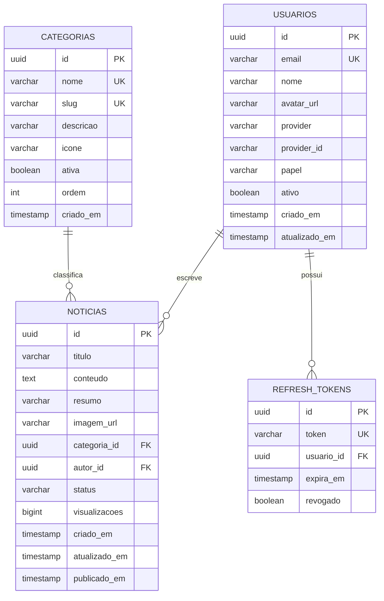

# 📰 Plano de Implementação — Portal de Notícias Populares

> **Aplicação escalável** com Java 25 + Spring Boot 3.x + Angular 20+ + PostgreSQL
> Seguindo rigorosamente as **regras-desenvolvimento-java-angular**

---

## 📋 Visão Geral do MVP

| Aspecto | Detalhe |
|---------|---------|
| **Backend** | Java 25 LTS, Spring Boot 3.x, Clean Architecture + DDD, Liquibase |
| **Frontend** | Angular 20+, Standalone Components, Signals, Slash Command Editor |
| **Banco** | PostgreSQL (Oracle Free Tier 1GB RAM) |
| **Auth** | Google OAuth2 + JWT |
| **IA** | Gemini API (geração de imagem + texto de notícias) |
| **Infra** | Docker Compose local (front + back + banco), deploy front Vercel futuro |

---

## 🏗️ Estrutura de Pastas do Projeto

```
D:\publique_sua_noticia_popular\
├── backend/
│   ├── Dockerfile.dev
│   ├── pom.xml
│   └── src/main/java/com/noticiapopular/
│       ├── kernel/                          # Kernel compartilhado
│       │   ├── domain/
│       │   │   ├── valueobjects/
│       │   │   └── exceptions/
│       │   ├── application/
│       │   │   ├── dtos/
│       │   │   └── ports/
│       │   └── infrastructure/
│       │       ├── config/
│       │       ├── mappers/
│       │       └── security/
│       ├── autenticacao/                    # Módulo Autenticação
│       │   ├── domain/
│       │   ├── application/
│       │   └── infrastructure/
│       ├── categorias/                      # Módulo Categorias
│       │   ├── domain/
│       │   ├── application/
│       │   └── infrastructure/
│       ├── noticias/                        # Módulo Notícias
│       │   ├── domain/
│       │   ├── application/
│       │   └── infrastructure/
│       └── inteligenciaartificial/          # Módulo IA (Gemini)
│           ├── application/
│           └── infrastructure/
├── frontend/
│   ├── Dockerfile.dev
│   ├── angular.json
│   ├── package.json
│   └── src/app/
│       ├── core/                            # Guards, interceptors, config
│       ├── shared/                          # Componentes reutilizáveis
│       ├── components/
│       │   ├── auth/                        # Login Google OAuth
│       │   ├── feed/                        # Feed de notícias
│       │   ├── noticia-editor/              # Editor com slash command
│       │   ├── noticia-modal/               # Modal criação/edição
│       │   ├── categorias/                  # Gestão de categorias (admin)
│       │   └── perfil/                      # Perfil do usuário
│       ├── services/
│       ├── models/
│       └── utils/
├── docker-compose.yml
├── .env.example
└── regras-desenvolvimento-java-angular/    # (já existe)
```

---

## 🎯 Etapas de Implementação

---

### ETAPA 1 — Infraestrutura e Scaffolding

**Objetivo:** Criar toda a base do projeto (back + front + docker) pronta para rodar localmente.

#### 1.1 Docker Compose

- **PostgreSQL** com imagem `postgres:16-alpine` (leve para 1GB RAM)
- **Backend** com [Dockerfile.dev](file:///D:/planning_poker/backend/Dockerfile.dev) multi-stage (Eclipse Temurin JDK 25 alpine)
- **Frontend** com [Dockerfile.dev](file:///D:/planning_poker/backend/Dockerfile.dev) (Node 22 LTS alpine)
- Configuração de **swap** documentada no README
- `.env.example` com todas as variáveis

```yaml
# Otimizações JVM para 1GB RAM:
JAVA_OPTS: >-
  -XX:+UseG1GC
  -XX:MaxRAMPercentage=60.0
  -XX:+UseStringDeduplication
  -Xss256k
  -XX:+UseCompressedOops
```

#### 1.2 Backend — Scaffolding Spring Boot

- [pom.xml](file:///D:/planning_poker/backend/pom.xml) com dependências:
  - Spring Boot 3.x (Web, Security, Data JPA, Validation, Actuator)
  - Liquibase, Lombok, jjwt, spring-boot-starter-oauth2-resource-server
  - spring-boot-starter-webflux (para chamadas Gemini API)
  - PostgreSQL driver
  - Testes: JUnit 5, Mockito, AssertJ, Testcontainers
- `application.yml` com profiles ([dev](file:///D:/planning_poker/backend/Dockerfile.dev), `prod`)
- `JacksonConfig` centralizado (regra DRY/mappers)
- `SecurityConfig` base com OAuth2
- `GlobalExceptionHandler` com hierarquia de exceções

#### 1.3 Frontend — Scaffolding Angular

- `npx -y @angular/cli@latest new ./ --standalone --routing --style=css --ssr=false`
- Configurar [tsconfig.json](file:///D:/planning_poker/frontend/tsconfig.json) com `strict: true`
- Criar estrutura de pastas (core, shared, components, services, models, utils)
- Configurar proxy para backend (`proxy.conf.json`)
- Interceptors: `AuthInterceptor`, `ErrorInterceptor`
- Guards: `AuthGuard`, `AdminGuard`

#### 1.4 Banco de Dados — Migrações Iniciais (Liquibase)

Tabelas a criar:

| Tabela | Campos Principais |
|--------|-------------------|
| `usuarios` | id (UUID), email, nome, avatar_url, provider, provider_id, papel (ADMIN/USUARIO), ativo, criado_em, atualizado_em |
| `categorias` | id (UUID), nome, slug, descricao, icone, ativa, ordem, criado_em |
| `noticias` | id (UUID), titulo, conteudo (TEXT/JSON), resumo, imagem_url, categoria_id (FK), autor_id (FK), status (RASCUNHO/PUBLICADA/ARQUIVADA), visualizacoes, criado_em, atualizado_em, publicado_em |
| `refresh_tokens` | id, token, usuario_id (FK), expira_em, revogado |

**Seed de categorias:**

```
Política, Economia, Tecnologia, Ciência, Saúde, Educação,
Esportes, Entretenimento, Cultura, Meio Ambiente, Internacional,
Brasil, Segurança, Opinião, Curiosidades, Games, Lifestyle,
Moda, Gastronomia, Viagens, Automóveis, Imóveis, Emprego
```

> [!IMPORTANT]
> Todas as migrações com rollback obrigatório, índices em campos de busca frequente (categoria_id, autor_id, status, publicado_em).

---

### ETAPA 2 — Autenticação (Google OAuth2 + JWT)

**Objetivo:** Login com Google, criação automática de conta, JWT com refresh token.

#### 2.1 Backend — Módulo `autenticacao`

**Domain:**
- Entidade `Usuario` (rica, com comportamento: `ativar()`, `desativar()`, `ehAdmin()`, `atualizarPerfil()`)
- Value Objects: `Email`, `PapelUsuario` (enum)
- Exceções: `UsuarioNaoEncontradoException`, `AcessoNegadoException`

**Application:**
- Use Cases: `AutenticarComGoogleUseCase`, `RefrescarTokenUseCase`, `BuscarPerfilUseCase`
- Ports: `UsuarioRepositoryPort`, `TokenProviderPort`, `GoogleOAuthPort`
- DTOs: `LoginGoogleRequest`, `TokenResponse`, `PerfilUsuarioDTO`

**Infrastructure:**
- `GoogleOAuthAdapter` — valida token Google, extrai dados
- `JwtTokenProvider` — gera/valida JWT + refresh token
- `SecurityConfig` — filtros, rotas públicas/protegidas
- `UsuarioRepositoryAdapter`, `UsuarioJpaRepository`

#### 2.2 Frontend — Componente `auth`

- Botão "Entrar com Google" usando `@abacritt/angularx-social-login` ou Google Identity Services
- `AuthService` com signals: `usuarioLogado`, `estaLogado`, `ehAdmin`
- `AuthInterceptor` — injeta JWT no header
- Persistência do token em `localStorage` (com verificação `isPlatformBrowser`)
- Redirect após login

---

### ETAPA 3 — Categorias (CRUD Admin + Seed)

**Objetivo:** CRUD de categorias para admin, listagem pública, seed no banco.

#### 3.1 Backend — Módulo `categorias`

**Domain:**
- Entidade `Categoria` (rica: `ativar()`, `desativar()`, `atualizarNome()`)
- Value Object: `Slug` (auto-gerado a partir do nome)

**Application:**
- Use Cases: `CriarCategoriaUseCase`, `ListarCategoriasUseCase`, `AtualizarCategoriaUseCase`, `DesativarCategoriaUseCase`
- DTOs: `CategoriaDTO`, `CriarCategoriaRequest`

**Infrastructure:**
- Controller `/api/v1/categorias` — GET público, POST/PUT/DELETE protegido (ADMIN)
- Seed via Liquibase (changeset de dados iniciais com as 23 categorias)

#### 3.2 Frontend — Componentes

- `CategoriaService` com cache (`shareReplay`)
- Página admin: CRUD com tabela, formulário modal
- Componente de seleção de categoria reutilizável (dropdown signal-based)

---

### ETAPA 4 — Módulo de Notícias (CRUD + Editor)

**Objetivo:** Criação, edição, exclusão de notícias com editor slash command.

#### 4.1 Backend — Módulo `noticias`

**Domain:**
- Entidade `Noticia` (rica: `publicar()`, `arquivar()`, `incrementarVisualizacao()`, `pertenceAoAutor(usuarioId)`)
- Value Objects: `ConteudoNoticia` (armazena JSON dos blocos do editor), `StatusNoticia` (enum)
- Exceções: `NoticiaNaoEncontradaException`, `AcessoNegadoException`

**Application:**
- Use Cases:
  - `CriarNoticiaUseCase` — cria rascunho vinculado ao autor logado
  - `PublicarNoticiaUseCase` — muda status para PUBLICADA
  - `EditarNoticiaUseCase` — valida que é autor ou admin
  - `ExcluirNoticiaUseCase` — soft-delete, valida permissão
  - `ListarNoticiasFeedUseCase` — paginado, filtrado por categoria, ordenado por data
  - `BuscarNoticiaPorIdUseCase`
  - `ListarNoticiasPorAutorUseCase`

- Ports: `NoticiaRepositoryPort`, `ArmazenamentoImagemPort`

**Infrastructure:**
- Controller `/api/v1/noticias`
  - `GET /` — público, paginado, filtro por categoria/status
  - `GET /{id}` — público (incrementa visualização)
  - `POST /` — autenticado
  - `PUT /{id}` — autor ou admin
  - `DELETE /{id}` — autor ou admin
- `ArmazenamentoImagemAdapter` — salva imagem local/S3

#### 4.2 Frontend — Editor de Notícias com Slash Command

**Baseado na implementação do Planning Poker:**

**Componentes:**
- `slash-command-menu/` — Menu contextual com `/` (reutilizado/adaptado do planning_poker)
  - Blocos: Parágrafo, H1, H2, H3, Quote, Bullet List, Numbered List, Código, Divider, Imagem
- `noticia-editor/` — Editor block-based com:
  - `contenteditable` divs por bloco
  - Undo/Redo (Ctrl+Z/Y) com histórico
  - Navegação por setas entre blocos
  - Merge/split de blocos no Enter/Backspace
  - Serialização para JSON (conteúdo estruturado)

**Diferenças do planning_poker:**
- Adicionar tipo de bloco `image` (para imagens no corpo)
- Adaptar para Angular 20+ com `input()`, `output()`, `signal()` (eliminar `@Input/@Output` legacy)
- Signals em vez de EventEmitter onde possível

---

### ETAPA 5 — Modal de Criação de Notícia com IA

**Objetivo:** Modal completo com geração de imagem via Gemini, geração de texto e preview.

#### 5.1 Backend — Módulo `inteligenciaartificial`

**Application:**
- Use Cases:
  - `GerarImagemComGeminiUseCase` — recebe prompt, chama Gemini API (Imagen/nano-banana), retorna URL da imagem gerada
  - `GerarTextoNoticiaUseCase` — recebe prompt, chama Gemini API, retorna texto estruturado
  - `RefinaTextoNoticiaUseCase` — recebe texto + instrução de refinamento

- DTOs: `GerarImagemRequest`, `ImagemGeradaResponse`, `GerarTextoRequest`, `TextoGeradoResponse`
- Ports: `GeminiApiPort`

**Infrastructure:**
- `GeminiApiAdapter` — chamadas HTTP reativas (WebClient) para Gemini API
  - Endpoint de geração de imagem (Imagen 3)
  - Endpoint de geração de texto (Gemini)
- Rate limiting para proteger a API key
- Controller `/api/v1/ia/` — POST `/gerar-imagem`, POST `/gerar-texto`, POST `/refinar-texto`

#### 5.2 Frontend — Modal de Criação (`noticia-modal/`)

**Layout do Modal (split-view):**

```
┌──────────────────────────────────────────────────────────┐
│  ✕  Criar Nova Notícia                                   │
├────────────────────────┬─────────────────────────────────┤
│  FORMULÁRIO            │  PREVIEW                        │
│                        │                                 │
│  📂 Categoria [▼]      │  ┌─────────────────────────┐   │
│                        │  │                         │   │
│  🖼️ Imagem:            │  │   [Imagem Preview]      │   │
│  ┌──────────────────┐  │  │                         │   │
│  │ Prompt IA...     │  │  └─────────────────────────┘   │
│  └──────────────────┘  │                                 │
│  [Gerar com IA] [Upload]│  Título da Notícia             │
│                        │  ──────────────────────────     │
│  📝 Título:            │  Lorem ipsum dolor sit amet...  │
│  ┌──────────────────┐  │  ...conteúdo completo...        │
│  │ Título...        │  │                                 │
│  └──────────────────┘  │                                 │
│                        │                                 │
│  📝 Prompt da Notícia: │                                 │
│  ┌──────────────────┐  │                                 │
│  │ Gere uma notícia │  │                                 │
│  │ sobre...         │  │                                 │
│  └──────────────────┘  │                                 │
│  [Gerar com IA]        │                                 │
│                        │                                 │
│  ✏️ Editar Notícia:    │                                 │
│  ┌──────────────────┐  │                                 │
│  │ Editor /slash    │  │                                 │
│  │ command          │  │                                 │
│  └──────────────────┘  │                                 │
│                        │                                 │
│  [Publicar] [Salvar Rascunho]                            │
└──────────────────────────────────────────────────────────┘
```

**Fluxo:**
1. Usuário escolhe categoria
2. Gera ou faz upload da imagem (preview à direita)
3. Escreve prompt para gerar notícia com IA → preview atualiza à direita
4. Se não gostar, edita com editor slash command OU pede refinamento via prompt
5. Ao publicar: vincula à conta do usuário

**Composables:**
- `use-gerar-imagem.ts` — estado da geração de imagem
- `use-gerar-noticia.ts` — estado da geração de texto
- `use-preview-noticia.ts` — preview reativo

---

### ETAPA 6 — Feed de Notícias

**Objetivo:** Feed público com notícias recentes, filtro por categoria, paginação infinita.

#### 6.1 Backend

- `ListarNoticiasFeedUseCase` com paginação cursor-based ou offset
- Filtros: categoria, busca textual (LIKE), ordenação (mais recentes, mais vistas)
- DTO resumido para feed: `NoticiaResumoDTO` (sem conteúdo completo)

#### 6.2 Frontend — Componente `feed/`

- Grid/lista responsiva de cards de notícias
- Cada card: imagem, título, resumo, categoria (badge), autor, data
- Filtro por categoria (chips/tabs)
- Infinite scroll ou paginação
- Skeleton loading com `@defer`
- Página de detalhe da notícia (`/noticia/:id`)
- Composable: `use-feed-noticias.ts`

---

### ETAPA 7 — Área do Usuário (Minhas Notícias)

**Objetivo:** Área para o usuário gerenciar suas notícias.

- Listagem das notícias do autor logado
- Status: Rascunho, Publicada, Arquivada
- Ações: Editar (abre modal com dados preenchidos), Excluir (confirmação)
- Página de perfil básica

---

### ETAPA 8 — Área Admin

**Objetivo:** Painel admin para gerenciar categorias e moderar notícias.

- Dashboard com estatísticas: total de notícias, usuários, categorias ativas
- CRUD de categorias
- Listagem de todas as notícias com filtros avançados
- Ação de moderar: aprovar/arquivar notícias
- Gestão de usuários: ativar/desativar
- Guard `AdminGuard` no frontend

---

### ETAPA 9 — Responsividade e Polish

**Objetivo:** Garantir responsividade total e UX premium.

- Design system com variáveis CSS (cores, espaçamentos, tipografia Google Fonts Inter/Outfit)
- Dark mode toggle
- Mobile-first: feed em coluna única, modal full-screen no mobile
- Micro-animações: hover em cards, transições suaves em modais
- Skeleton loading em todas as telas
- Toast notifications para feedback
- `NgOptimizedImage` para imagens
- Lazy loading de rotas
- `@defer` para componentes pesados

---

### ETAPA 10 — Testes e Otimização para Produção

#### Testes Backend:
- Unitários: entidades, value objects, use cases (Mockito)
- Integração: controllers com MockMvc
- Arquitetura: ArchUnit (validar Clean Architecture)
- Fixtures centralizadas

#### Testes Frontend:
- Unitários: composables, services (Jasmine/Karma)
- Componentes: Angular Testing Library

#### Otimização Docker para 1GB RAM:
- Imagem base `eclipse-temurin:25-jre-alpine` (apenas JRE, não JDK)
- Multi-stage build no Dockerfile
- JVM flags otimizadas (G1GC, MaxRAMPercentage)
- PostgreSQL: `shared_buffers=128MB`, `work_mem=4MB`, `effective_cache_size=256MB`
- Swap: `vm.swappiness=10`, swap file de 2GB

#### Docker Compose Produção:
```yaml
# Limites de memória:
backend:  mem_limit: 512m
postgres: mem_limit: 384m
# Restante para SO + swap
```

---

## 📐 Modelo de Dados (Mermaid)



---

## 🔐 Endpoints da API (Resumo)

| Método | Endpoint | Auth | Descrição |
|--------|----------|------|-----------|
| POST | `/api/v1/auth/google` | ❌ | Login com token Google |
| POST | `/api/v1/auth/refresh` | ❌ | Refresh token |
| GET | `/api/v1/auth/perfil` | ✅ | Perfil do usuário logado |
| GET | `/api/v1/categorias` | ❌ | Listar categorias ativas |
| POST | `/api/v1/categorias` | 🔒 ADMIN | Criar categoria |
| PUT | `/api/v1/categorias/{id}` | 🔒 ADMIN | Atualizar categoria |
| DELETE | `/api/v1/categorias/{id}` | 🔒 ADMIN | Desativar categoria |
| GET | `/api/v1/noticias` | ❌ | Feed paginado (filtro categoria) |
| GET | `/api/v1/noticias/{id}` | ❌ | Detalhe da notícia |
| POST | `/api/v1/noticias` | ✅ | Criar notícia |
| PUT | `/api/v1/noticias/{id}` | ✅ | Editar (autor ou admin) |
| DELETE | `/api/v1/noticias/{id}` | ✅ | Excluir (autor ou admin) |
| GET | `/api/v1/noticias/minhas` | ✅ | Notícias do autor logado |
| POST | `/api/v1/ia/gerar-imagem` | ✅ | Gerar imagem com Gemini |
| POST | `/api/v1/ia/gerar-texto` | ✅ | Gerar texto de notícia |
| POST | `/api/v1/ia/refinar-texto` | ✅ | Refinar texto existente |
| POST | `/api/v1/upload/imagem` | ✅ | Upload de imagem manual |
| GET | `/api/v1/admin/usuarios` | 🔒 ADMIN | Listar usuários |
| PATCH | `/api/v1/admin/usuarios/{id}` | 🔒 ADMIN | Ativar/desativar |
| GET | `/api/v1/admin/dashboard` | 🔒 ADMIN | Estatísticas |

---

## ✅ Documentos de Regras Considerados

- [regras.md](file:///D:/publique_sua_noticia_popular/regras-desenvolvimento-java-angular/regras.md) — Princípios fundamentais (Clean Architecture, SOLID, DRY, KISS)
- [regras-backend.md](file:///D:/publique_sua_noticia_popular/regras-desenvolvimento-java-angular/regras-backend.md) — Java 25, Spring Boot 3.x, DDD, Liquibase, Segurança
- [regras-frontend.md](file:///D:/publique_sua_noticia_popular/regras-desenvolvimento-java-angular/regras-frontend.md) — Angular 20+, Signals, Standalone, OnPush, Composables
- [regras-testes.md](file:///D:/publique_sua_noticia_popular/regras-desenvolvimento-java-angular/regras-testes.md) — JUnit 5, Mockito, AssertJ, Angular Testing
- Editor slash command referência: [planning_poker board-editor](file:///D:/planning_poker/frontend/src/app/features/boards/pages/board-editor/board-editor.component.ts)

---

## 🚀 Ordem de Execução Recomendada

1. **Etapa 1** — Infraestrutura (Docker + scaffolding) → ~1 sessão
2. **Etapa 2** — Autenticação Google OAuth → ~1 sessão
3. **Etapa 3** — Categorias + Seed → ~1 sessão
4. **Etapa 4** — Notícias CRUD + Editor Slash Command → ~2 sessões
5. **Etapa 5** — Modal de Criação com IA → ~2 sessões
6. **Etapa 6** — Feed de Notícias → ~1 sessão
7. **Etapa 7** — Área do Usuário → ~1 sessão
8. **Etapa 8** — Área Admin → ~1 sessão
9. **Etapa 9** — Responsividade e Polish → ~1 sessão
10. **Etapa 10** — Testes e Otimização → ~1 sessão
